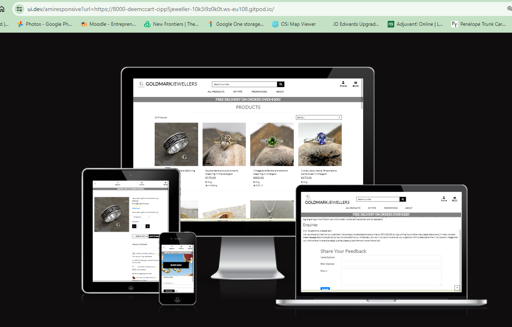
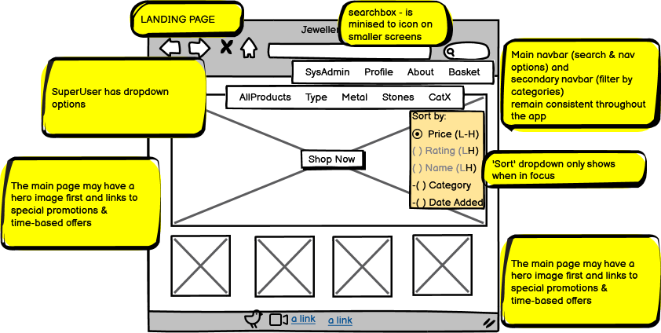
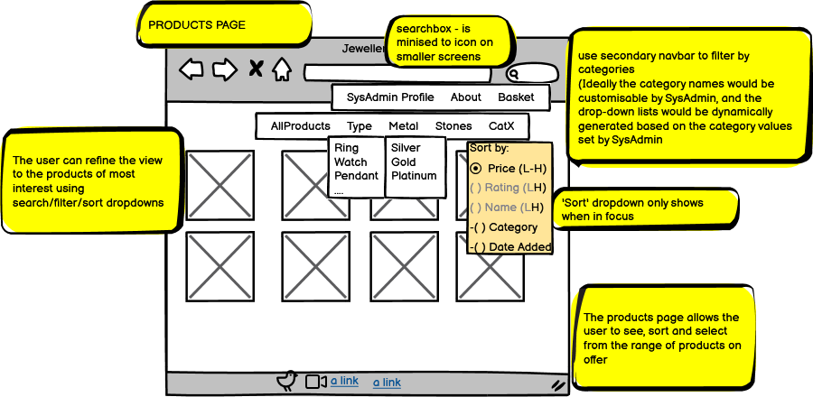
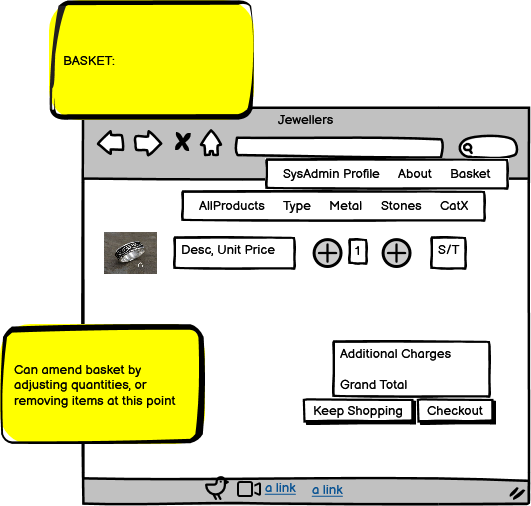
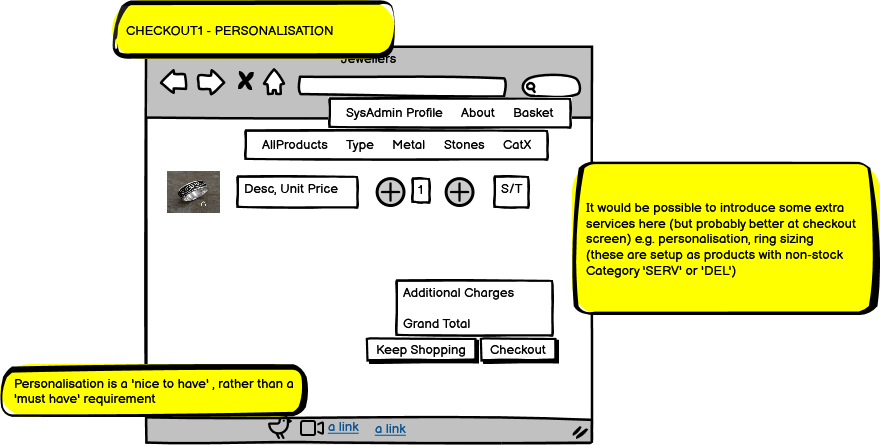
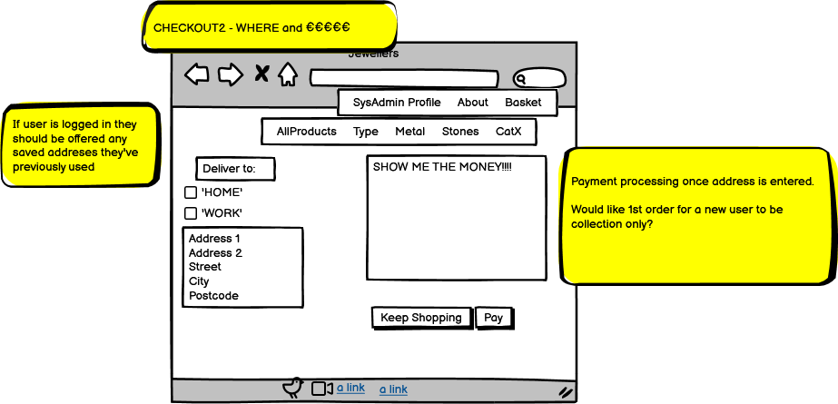

# Jeweller 
Developer:  **Deirdre McCarthy**, Feb 2024

### Live webpage link

# Table of Contents:
1. [About](#about)
    1. [Responsiveness](#responsiveness)
2. [Project Goals: ](#project-goals)
    1. [UX Design - Strategy ](#ux-design-strategy) 
    2. [UX Design - Strategy - Competitor Portals](#ux-design-strategy-analysis-of-competitors)
    3. [UX Design - Strategy - Target Audience](#ux-design-strategy-target-audience)
3. [Ecommerce and Marketing Stagtegy](#ecommerce-strategy)
    1. [Ecommerce Business Model](#e-commerce-business-model)
    2. [Business impacts of adopting an ecommerce strategy](#business-impacts)
    3. [Customer Profiles](#customer-profiles)
    4. [Marketing Strategy](#marketing-strategy)
3. [UX Design - Scope](#ux-design-scope)
    1. [UX Design - Scope - User Requirements and Expectations](#user-requirements-scope)
    2. [UX Design - Scope - Geographical](#shipping-constraints)    
    3. [UX Design - Scope - Data](#data-scope)
4. [User goals/ user stories: ](#user-goals-user-stories)
    1. [Site Owner Goals](#site-owner-goals)
    2. [First-time User Goals](#first-time-user-goals)
    3. [Returning User Goals](#returning-user-goals)
5. [Further UX Design: ](#ux-design-decisions)
    1. [Skeleton - Wireframes; ](#wireframes)
    2. [Surface - Fonts; ](#fonts-chosen)
    3. [Surface - Colours](#colour-scheme)
    4. [Surface - Imagery](#design-images)
6. [Database](#database)
    1. [Conceptual database design](#database-design)
    2. [Database schemas](#database-schema)
    3. [Techncial implementation](#database-technical)
7. [Agile Methology: ](#agile)
    1. [Project setup](#project)
    2. [Designing an Issue Template](#issue-template)
    3. [Creating project issues](#project-issues)
    4. [EPICs ](#epics)
    5. [MoSCoW Prioritisation;](#moscow-prioritisation)
    6. [Level of Effort estimation - Story Points](#story-points)
    7. [Project Milestones](#milestones)
    8. [Project Sprints](#sprints-and-iterations)
    9. [Issue Lifecycle](#issue-lifecycle)
    10. [Project tabular view](#tabular-projects-view)
    11. [Kanban board](#kanban-board)
    12. [Observations and learnings](#agile-observations-and-learnings)    
8. [Features](#features)
    1. [Included](#features-in-scope)
    2. [Mapped to user stories](#)
    3. [Future Development](#features-left-to-implement)
9. [Technology](#technologies)
    1. [Languages](#langugages)
    2. [Frameworks and Tools](#frameworks--tools)
9. [Validation](#validation)
    1. [HTML Validation](#html-validation)
    2. [CSS Validation](#css-validation)
    3. [Javascript Validation](#javascript-validation)
    4. [Accessibility](#accessibility)
    5. [Performance](#performance)
    6. [Multi-device Testing](#multi-device-testing)
    7. [Multi-browser Testing](#multi-browser-testing)
    8. [Testing user stories](#testing-user-stories)
    9. [Unfixed Bugs](#unfixed-bugs)
10. [Accessibility](#accessibility)
11. [Performance](#performance)
12. [Deployment](#deployment)
13. [Credits](#credits)
    1. [Content](#content)
    2. [Media](#media)
    3. [Code](#code)
    4. [References](#references)
    5. [Acknowledgements](#acknowledgements)

## About
---------
Jeweller is a system which is designed for a real-life retail Jewellery business.  This business built a first website 4 years ago, but it was not integrated with the retail business or everyday processes, and was never successfully implemented.  
The existing website remains in use as a 'shop window' for off-the-shelf items, but is not actively maintained, with many products showing as 'out of stock', and online orders discouraged.  The business owners are, however, quite active on social media (facebook and Instagram) for (free) advertising and organic marketing - marketing to existing customers and friends of the business.  

Facebook is used to  showcase custom-made products, and to prompt time/event-based purchases, e.g. Valentines Day, Communion, Mothers Day, Confirmation, Fathers Day, monthly birth-stone, Christmas.   The business operates in a medium sized town in the south-east of Ireland, and currently makes all sales in-person, relying on the customer to physically visit.  (Often this will begin with an enquiry phonecall) .  There are two competing jewellers in close proximity.

The Jeweller business offers four retail (B2C) & 1 trade (B2B) line of business:
* retail jewellery, brand-name watches, zippo lighters, accessories - off the shelf;
* personalised retail jewellery, e.g. engraved lighters or hip flasks.
* retail jewellery - custom-made (this process generally begins with the customer making an enquiry as to a particular design, or wishing to re-use and re-fashion their own gold jewellery items);
* retail services - repairs, watch batteries, watch straps and valuations;
* trade repairs (on behalf of other jewellery retailers);

As a family-owned and -operated business the unique selling points are:
* well established, multi-generational business (the owners are the 3rd generation to operate jewellery businesses in Ireland, and have been in operation in their current location for approx 35 years);
* skilled craftsmanship, with the use of high tech equipment (e.g. laser welder) which means that challenging repair jobs can be undertaken;
* quick turnaround time for repairs;
* personable approach, investment in long term, personal, first-name-terms relationship with customers, which leads to significant repeat business;
* celtic and heraldic jewellery creation;
* affordable pricing and payment flexibility e.g. lay-away schemes allowing customer to pay initial deposit & staged payments before obtaining the product.  

The challenges of the current business model (which may be partly addressed with a fresh ecommerce strategy) are:
* Existing customer base is aging, wish to reach a newer generation & persuade them of the value offering
* Competition from online retailers (the 'low cost' model)
* Retail business is staff-intensive and can take skilled staff away from more profitable back-room tasks
* Wish to differentiate vs. local jewellers
* Raising awareness of range of offerings (e.g. Repairs business) with potential local customers who may not have physically visited the shop.
* Promoting unique or non-mainstream products produced and sold within the Jeweller shop.

**This Jeweller e-commerce offering** is:
* a B2C website
* proposed integration with the Jeweller's business processes
* an integrated marketing strategy with example content 

### Responsiveness
The site is built, with the help of Bootstrap & CSS media queries, to be largely responsive so it can be used on a range of devices.
It is anticipated that certain system admin tasks such as adding or maintaining products, maintaining customer orders, will be performed on a mid to large screen device - a tablet or desktop.  The shop currently has a laptop and a tablet for performing admin tasks.

Responsive Mockup

## Project Goals
----------------
1. To provide a website and associated marketing materials
2. Which aligns with the jewellers current business processes
3. Extend reach into new market segments
4. Which uses the capabilities of Django python, HTML, CSS and Javascript.
5. And is accessible, responsive and relevant.
  
### UX Design Strategy

* Good navigation is key.
* Good quality imagery for product photos.  
* Flexible site with good search and filter capabilities.
* User feedback form to handle/encourage enquiries

### UX Design Strategy Analysis of Competitors

The following websites were reviewed as part of an assessment of features:
* Two local jeweller's websites;
* The existing website ([Goldmark.ie](https://goldmark.ie/))
* ([Simone Walsh](https://simonewalsh.com/collections)) Australian jeweller 
* Other Irish retailers such as ([House of Lor](e.g. https://houseoflor.com/))
* I also took inspiration from ([Brooks Running](https://www.brooksrunning.com/en_gb)) for good product categorisation and strong visual display.

Generally the websites in this space tend to be strong on imagery and imagination, but perhaps somewhat lacking in personality and features.  The jewellery website Simone Walsh australian jeweller stands out as having some very interesting and relatable features such as an asynchronous 'chatbot' approach to FAQ.

The Jeweller website delivered in this project is functional and, provides a strong e-commerce solution with good functionality and features, but needs further UX work to implement some of the very visually appealing design approaches that elevate a site and encourage users to spend more time browsing and admiring products.

### UX Design Strategy Target Audience
Target audience is people who might not otherwise make it across the physical threshold
* Individuals with an interest in Celtic jewellery
* Individuals with an interest in personalised jewellery (e.g engraved)
* Individuals who have a unique or unusual requirement e.g. fainne badges
* Individuals who seek unique custom-made jewellery to be made with jeweller-provided stones and metals
* Individuals who seek unique custom-made jewellery to be re-made from their existing jewellery items
* Local people who are not aware of the services on offer (particularly repairs)
* Who have some purchasing power
* Who are based in Ireland
* And possibly have a connection to Carlow Town

## Ecommerce Strategy
---------------------------------

### E-Commerce Business Model
Jeweller is a B2C platform whose goal is to extend the reach of the existing physical business and increase awareness beyond the current customer base.  
High-value products are offered for sale, which the customer can browse annonymously without feeling social pressure to complete a purchase.

The retailer is keen to continue to promote physical presence - jewellery tends to be a very personalised purchase, with the customer keen to see and touch the product before committing.
Therefore a 'click and collect' option has been added to encourage site visitors to physcially come and make their purchase.

### Business Impacts
The benefits for the business owners are: 
1. Extends the shop window
2. Makes people aware of jewellery products for sale 
3. Allows users to raise enquiries outside 9:30-5:30x 6 days opening hours
4. Promotes awareness of services provided such as cleaning, repairs, watch batteries, refashioning of personal jewellery into a new creation.
5. High gain for relatively low cost through use of in-house web design and low-cost promotions/campaign management using MailChimp.
6. Enourage customer to physically visit to collect click&collect purchases
7. Use of 'lead times' allows the Jeweller to manage ebb & flow of work
8. Automated emailed notifications to customers save time rather than needing to call or text
9. Less time on phone called inquiries
10.  Greatly increased visibility of buying patterns

The challenges for the business owners are:
1. Additional enquiries must be reponded to, and are perhaps less likely to result in a sale than in-person inquiries
2. Reduced opportunities for up-/cross-selling compared to a physical visit (this should be improved in future Jeweller versions )
3. Overhead in maintaining the website and keeping it 'fresh'
4. Overhead in generating newsletter and blog content
5. Concern about customer returns* and increased business costs as a result
6. Concerns about needing to deal with lost or missing deliveries

(*) The business owners pointed out that consumer rights for online purchases are heavily weighted towards the consumer particularly with no fault/ change of mind returns.  With physical purchases, change of mind customers are legally entitled to a credit note/exchange, whereas online purchases can result in a refund and a loss to the retailer of packaging/restocking/shipping costs.   

### Customer Profiles

User 1: It is anticipated that a typcial site user will be from the existing customer base, female aged 30 to 60.  
This person will likely be making a purchase for themselves, in which case customised jewellery is of particular interest.
They may alternatively be gifting for family or friends, and seeking a present for a specific occasion.  They may have spotted an item of interest on fb or Instragram and want to follow up with a purchase, but lead busy lives and may prefer the convenience of online enquiries/ online ordering.

User 2: Female aged between 50 and 90 (or above).  This customer may likely use the website as a 'shop window' and physically come into the shop to create or complete their purchase.  This customer typically has both time and money, and will react to affinity marketing, likes to feel close to the brand and to feel a personal connection with the shop owners.   

User 3: Couples getting engaged or married who need engagement and/or wedding rings.  

User 4: Males seeking gifts for close females in their life.  These purchasers are likely to be suggestible (so newsletter prompts to purchase certain occasion items can act as a nudge to purchase) as they are unsure of what their partner would like.  Often under time pressure due to delayed purchasing decisions, e.g. Christmas-eve shoppers, and willing to pay a premium to ensure the gift is acceptable.

User 5:  Persons (male or female) with a strong interest in celtic jewellery, particularly when it is personalised for them (sizing, engraving, one-off-modifications)

### Marketing Strategy

The plan for Jeweller going forward is to:

1. Build on the organic marketing already being done on facebook and Instragram (which generally gathers up to 20 likes and comments per post), extend this by always including a website link in the marketing content.  Similarly link from the website to these social media platforms.
2. Build content in the 'about' section of the website (it is designed to be quite maintainable from the admin console) to build the website's credibility and increase awareness and alignment with potential customers.  Fresh, regularly updated website content should increase SEO rankings.
3. Build text in individual product descriptions using SEO keywords  
4. Encourage customers to create profiles and leave reviews, and dedicate time to moderating, responding to, and curating these reviews. Encourage customers to create a photo for their profile, this personalises the experience and promotes brand affinity & a sense of 'belonging'. 
5. Encourage customer feedback and consider customer questinos and suggestions when introducing or modifying products
6. Gain subscribers through the mailchimp application and track response rates; tune the product offerings accordingly.  Each newsletter should include a call-to-action. 

Note that, the business does have an active facebook page at https://www.facebook.com/goldmarkjewellerscarlow.jewellers/, however for the purpose of this project a specially-created facebook page was created at https://www.facebook.com/profile.php?id=61556652324443, and this link is used on the Jeweller version1 website. 

### SEO Keywords
By looking at competitor websites, and gaining some understanding of the Jeweller's business strategy, certain keywords were chosen.  Because of the range of products offered, it is quite a long list.  The american spelling jewelery (one l as opposed to two) was included as american tourists often have a strong interest in celtic or heritage jewellery.

Short-tail jewellery, jewelry, jewellers, jewellery Ireland, jewelry Ireland, jewellers carlow, carlow town, tullow street, dolmen, ducketts grove, Ireland Jeweller, Irish jewellery, celtic jewellery, celtic jewelry, 
        engagement ring, engagement ring carlow, wedding ring, wedding rings, carlow wedding rings,
        silver, gold, yellow gold, white gold, platinum, 
        claddagh ring, celtic knot, celtic jewellery, tie-pin, tiepin, brooch, earrings,  
        silver pendant, silver rings, diamond, pearl, garnet, cubic zirconia, cubic zircona,   
        family business, jewellery, jewelry Ireland, craft, bespoke jewellery, 
        watch, watches, watch strap carlow, watch battery, watch batteries, watch repairs, same-day service, same day,
        lighter, lighters, ring, rings, pendant, pendants,
        jewellery repairs, fix broken chain,
        jewellery engraving,  ogham, engrave, customised jewellery, remodelled jewellery, handmade jewellery, rhodium plating rings,

Long-tail keywords include: 

### Sitemap.xml

A sitemap was generated using the Free Online Sitemap Generator www.xml-sitemaps.com, and added to the site, which will help Google to search the site effectively.

### Robots.txt

A robots.txt file was created which points to the sitemap allowing google to crawl the site.  I blocked the account pages as these are generic and not unique to this site.

## UX Design Scope
----------------

### User Requirements Scope
<ul>MVP Requirements:
    <li>Must be intuitive to use</li>
    <li>Must be easy to learn</li>
    <li>Good for first time or returning users</li>
    <li>Accessible - no ad display & no paywall</li>
    <li>Easy search & filter</li>
    <li>Images quick to load</li>
    <li>Order processing straightforward and intuitive</li>
</ul>
 
<ul>Requirements - Desirable:
    <li>Should have administrator portal which allow for:</li>
    <li> creation and maintenance of product catgories</li>
    <li> easy creation and maintenance of products, with defaults coming from parent category</li>
    <li> easy upload of product images</li>
    <li> a means of integrating blogs</li>
    <li> a means of integrating date-based promotions</li>
</ul>

### Shipping constraints:
Currently interested in orders to be shipped within Ireland only.
The business is comfortable using registered mail as a shipping method.
The business would ideally prefer to implement 'click and collect' and largely use the website as an extension of the physical shop window.

### Data Scope
To build this project, product images and details from the jeweller's facebook posts over the last 3 years was harvested, and formed into a Google sheets database, which was used to control initial manual dataload into the DEV environment.
Once loaded it was possible to transfer these test products via json export/import into the PROD database.
Products are now maintained directly in the PROD database.

Test customers (with real email accounts) and test payment details ONLY have been used during validation and initial user testing.

## User Goals/ User Stories
----------------

Written in the format 'As a **role** I want to **action** to achieve **desired outcome**    

### First-time User/ Unregistered User
| ID |  **I want to** | **to achieve** |
| -- |  -- | -- |
| FTU_01  | quickly understand the site purpose | decide whether to spend time exploring and discovering the site |
| FTU_02  | easily navigate the site | don't become frustrated and leave |
| FTU_03  | receive feedback at each step on the site | understand what I am doing, and, if I'm in a multi-step process, I understand how far along I am in the processs |
| FTU_04  | access this site on a device of my choosing (mobile, tablet, laptop, desktop) | access by a method and at a time that is convenient and accessible to me |
| FTU_05  | navigate the site without mandatory login| I can discover site features before deciding whether to commit to using site| 
| FTU_06  | see a range of products which are offered by the Jeweller, to see pictures, descriptions price (for off-the-shelf items), lead-time for each item | make purchase decisions| 
| FTU_07  | whether an item is in-stock, made-to-order** and **what are lead times (e.g. available now, lead time 6 weeks for make-to-order, lead time 1 week for casted items)| make purchase decisions  | 
| FTU_08  | search for a product by name or description  |  does Jeweller sells the item of interest| 
| FTU_09  | filter my product view | see only what I'm interested in ** (e.g. particular metals, stones, colours, particular occasions) (Preferably filter by multiple categories)
| FTU_10  | sort my product view by price, date added .... | see the items most relevant to me| 
| FTU_11  | view custom products | get inspiration for my design idea| 
| FTU_12  | receive prompt on affinity items | see items that are related to the item I'm interested in (e.g. earrings may have matching necklace or bracelet)| 
| FTU_13  | receive suggestions or prompts for particular occasions (which could be date-related e.g. communions, confirmations, mothers day, christmas)| 
| FTU_14  | share/like a item I like with a 3rd party (e.g. via whatsapp, fb etc) | prompt them to buy it (for me!) <- affinity marketing| 
| FTU_15  | create a shopping basket of items| determine price | 
| FTU_16  | amend or remove items in my shopping basket | determine price| 
| FTU_17  | convert my shopping basket into a collection order | purchase items| 
| FTU_18  | personalise my order | reflect gift messages, special wrapping etc| 
| FTU_19  | pay for my order using credit card | ensure the purchase is completed| 
| FTU_20  | receive an on-screen confirmation of order number | ensure the purchase is completed| 
| FTU_21  | receive email/text notifying me of my order number and lead time | plan when to collect| 
| FTU_22: | complete an enquiry form | ask a question about products or services | 
| FTU_23: | see services offered (repairs, make-to-order items | benefit| 
| FTU_24: | browse the Jeweller's blog | increase my affinity with this retailer| 
| FTU_25: | consult the Jeweller's FAQ | understand the retailer's processes for orders, shipping etc| 
| FTU_26: | signup for newsletter | increase my affinity with this retailer| 
| FTU_27: | create a profile | track my history with this retailer| 
| FTU_28 (Future):| make an appointment for engagement rings | elevate a high value buying decision| 

### Returning User - Additional Goals
| ID |  **I want to** | **to achieve** |
| -- |  -- | -- |
| RU_01 | quickly navigate to the Products Page | focus on items i'm most intersted in| 
| RU_02 | filter products by type, type-of-metal, type-of-stone| see the products I am most interested in| 
| RU_03 | sort products** by **date added** so i can see what is new on the site| 
| RU_04 |  receive prompts of upcoming celebration days and associated promotions|  
| RU_05 | be prompted with affinity products, based on on what I've previously purchased | make coordinated buying decisions| 
| RU_06 | view my order status | know if the order has been shipped| 
| RU_07 | raise product enquiries on the site |  save time rather than phonning| 
| RU_08 | receive an emailed newsletter periodically |  alerted to promotions| 
| RU_09 | add or update contact details and preferences (email, phone number) on my profile  | Jeweller can contact me in a way that suits me| 
| RU_10 | add an image of my choosing to my profile | personalise my experience|  
| RU_11 | assign delivery address(es) to my account | streamline the ordering process| 
| RU_12 | choose a saved delivery address when placing an order | streamline the ordering process| 
| RU_13 | create Product Reviews and ratings | increase interaction with the site and help to guide other purchasers| 
 
### Site owner/moderator Goals
| ID |  **I want to** | **to achieve** |
| -- |  -- | -- |
| SO_01 | provide a system that is easy to use | encourage users to visit and return to the site |  
| SO_02 | provide responsive web pages | encourage users to use the site across multiple devices| 
| SO_03 | include social links | increase user engagement with site| 
| SO_04 | use the site as a shop window | facilitate unregistered users who will complete purchases in-person| 
| SO_05 | permit guest checkout | facilitate unregistered users to complete purchases on the site| 
| SO_06 | track orders raised | ensure they progress through the shipping lifecycle| 
| SO_07 | link to an post tracking | provide delivery status to customers| 
| SO_08 | create and maintain product catgories | benefit| 
| SO_09 | create and maintain items | benefit| 
| SO_10 | identify make-to-order/custom products as well as off-the-shelf products  | advertise both business streams| 
| SO_11 | create and maintain item affinities | benefit| 
| SO_12 | create and maintain time-based marketing promotions | benefit| 
| SO_13 | link products product categories to marketing promotions | | 
| SO_14 | provide a robust payment interface | maintain trust and integrity and minimse payment queries| 
| SO_XX | showcase my Jewellery business professionally  | align with my business values and processes| 
| SO_XX | provide straightforward, intuitive, consistent website navigation,  | ease of use and encourage re-use| 
| SO_XX | provide a website, which meets current programming, performance and accessibility standards (html, css, javascript, responsive, accessibility, performance)|  | 
| SO_XX | provide an opportunity for the user to provide feedback, including reporting issues, or suggesting improvements to the Jeweller site| greater engage with users  | 
| SO-XX | acknowledge to the user that their feedback has been received| encourage feedback  |  

  
## UX Design Decisions
----------------------

### Wireframes

Landing Page, search & filter functionality 

Product Search

Product detail

Create a basket

Checkout - additional selections

Checkout - address page/action tracker

  
### Fonts Chosen
(To be completed)

### Colour Scheme 
A plain white page backdrop was implemented.
This is to complement the existing design images which tend to be against textured, natural backgrounds, stone and wood etc.
Text and buttons shown in a near-black colour with certain notificiations showing teal-coloured button or text. 

### Design Images
The Jeweller's existing design images which had been uploaded to facebook, were re-used for this Version 1 implementation.
The landing page provides a splash of colour, this uses a recent flyer image developed by the Jeweller.

## Database

### Database design

### Database Schema

Profiles App

 

#### User Model (from AllAuth)
| id | Field |
|--|--|
|first_name|CharField|
|last_name|CharField|
|username|CharField|
|email|EmailField|
|phone_number|CharField|
|date_joined|DateTimeField|
|last_login|DateTimeField|
|is_admin|BooleanField|
|is_staff|BooleanField|
|is_active|BooleanField|
|is_superadmin|BooleanField|

#### UserProfile Model

| id | Field |
|--|--|
|user|OneToOneField|
|phone_number1|Charfield|
|profile_image|ImageField|
|created_on|DateTimeField|

#### UserAddress Model
| id | Field |
|--|--|
|user_profile|OneToOneField|
|address_type|Charfield| default 'BILL'
|address_id|CharField|default 'HOME'
|address_label|CharField|
|profile_image|ImageField|
|created_on|DateTimeField|
|address1|CharField|
|address2|CharField|
|town_or_city|CharField|
|county|CharField|
|postcode|CharField|
|country|CountryField|
|created_on|DateTimeField|

---

Products App

 

#### Category Model
| id | Field |
|--|--|
|name|OneToOneField|
|friendly_name|Charfield| 

#### Products Model
| id | Field |
|--|--|
|category | ForeignKey('Category')|
| sku | CharField |
| name | CharField |
| hide_display | BooleanField |
| can_be_engraved | BooleanField |
| max_char_engrave | IntegerField |
| price | DecimalField |
| source | CharField| choices=ITEM_SOURCE_CHOICES, default='STOCK')
| item_lead_time | IntegerField |
| promotion | CharField |
| image | ImageField |
| image_url | URLField |
| description | TextField |
| rating | DecimalField |
| created_on | DateTimeField |

#### StockType Model
| id | Field |
|--|--|
| source | CharField |
| default_lead_time | IntegerField |
| name | CharField |

#### Review Model
| id | Field |
|--|--|
| user_profile | ForeignKey(UserProfile) |
| product | ForeignKey(Product) |
| title | CharField |
| body | CharField |
| review_rating | DecimalField |
| approved | BooleanField |
| created_on | DateTimeField |

---

Checkout App

 

#### Order Model
| id | Field |
|--|--|
| order_number | CharField |
| user_profile | ForeignKey(UserProfile) |
| full_name | CharField |
| email | EmailField |
| phone_number | CharField |
| street_address1 | CharField |
| street_address2 | CharField |
| town_or_city | CharField |
| county | CharField |
| country | CountryField |
| postcode |CharField |
| date |DateTimeField |
| planned_ship_date | DateField |
| delivery_method | CharField | default='REGPOST'
| delivery_track | CharField |
| order_status | CharField | default='ORDERED'
| delivery_cost | DecimalField |
| order_total |DecimalField |
| grand_total | DecimalField |
| original_basket | TextField |
| stripe_pid | CharField |

#### OrderLine Model
| id | Field |
|--|--|
| order | ForeignKey(Order) |
| line_number| IntegerField |
| product | ForeignKey(Product) |
| sku | CharField |
| quantity |IntegerField |
| price | DecimalField |
| category | CharField |
| product_size | CharField |
| can_be_engraved |BooleanField |
| engrave_text |CharField |
| lineitem_total |Decimal |
| line_ship_date = DateField |

#### OrderLine Model
| id | Field |
|--|--|
| order | ForeignKey(Order) |
| address_type | CharField |
| address_id | CharField |
| address_label |CharField |
| address1 | CharField |
| address2 | CharField |
| town_or_city | CharField |
| county | CharField |
| postcode | CharField |
| country | CountryField |
| created_on | DateTimeField |

---

Home App

 

#### AboutSection Model
| id | Field |
|--|--|
| section | CharField |
| disp_seq | IntegerField |
| hide_display | BooleanField |
| section_title | CharField |

#### AboutText Model
| id | Field |
|--|--|
| section | ForeignKey(AboutSection) |
| disp_seq | IntegerField |
| hide_display | BooleanField |
| text_title | CharField |
| text_body | TextField |

---

### Database Technical
The DEV environment was built using a sqlite backend, this was migrated to a PostGRES SQL database on the ElephantSQL platform for the PROD environment.  (This is a medium-term solution as ElephantSQL have made an end-of-life announcement  for Jan 2025).  Static data for the site (css and site images) is stored on AWS S3 buckets, which provides a robust interface with strong security features.  

## Agile
--------

An Agile approach was followed in plannning this project.  

Github Issues and Projects were used to track project work as follows:
* Sprints - The project was organised into 5 one-week sprints/iterations Sprint1..Sprint5 (the final sprint was allowed an extra 5 days to complete).
* EPICS - created to track the various streams of work; Stored as github issues (to allow a task hierarchy) AND as Issue custom fields (to allow for analysis in github insights).  Each EPIC typically includes quite a few sub-issues.  
* 6-7 EPICs created for this proect
* Issues - created to represent items of work.  Typically one issue was created per User Story.  A template was used to keep these consistent (and save on keying), which requires a title, parent EPIC reference, statement in the form of As a **role** I want to **action** in order to **benefit**, Pre-requisites, Acceptance criteria and Tasks.  Where a user story was completed across multiple sprints, I tried to split it into sub-tasks so it became multiple issues.  Some issues were created for tasks that were necessary but didn't align with an individual user story - e.g. deployment, MVP deployment, Version1 deployment.
* 70 User Story/Task issues were created for this project.
* Gitpod commit messages can reference #XX, this links to issue XX.  
* Github allows multi-media comments per issue,  I used this to hold screenprints as **proofs** of task completion. 
* Bugs - Generally these were tracked using an excel spreadsheet so as not to clutter the Kanban board, I logged 130 bugs/ observations over the project duration.
* Kanban boards - 4 status buckets - backlog, in-progress, review, done.  
* Labels - Used to track MoSCoW prioritisation
* Project fields: Prioritities P0 = top triority, P1, P2
* Project fields: T-shirt Sizing used when grooming backlog at end each sprint
* Project fields: Estimated Story Points (time); actual SPs - used for end-of-spring analysis   
The entire approach was covered under the EPIC 'Agile' and can be seen under this link: https://github.com/DeeMcCart/CI_PP5_Jeweller/issues/10

 
### Project
A github project was created within the Jeweller repo.  At a high level the project details are very simple really just a name and description.

At the outset, an issue template was setup for user stories, with 5 sections - EPIC, requirement, pre-requisites, acceptance criteria, tasks.  This template made it easier to structure issues when created.  I also setup a template for bug reporting, but found it too cumbersome for practical use.

### Project Issues
Issues were created to track planned end-to-end work in Financial_Planner, using the issue template for consistent appearance and 

### EPICs
This project had 10 EPICs, it is easiest to get a picture of these from the Kanban board below.  
For cross-reference EPIC is also listed at the top of each issue, so it is possible to click from a child issue to its parent EPIC and vice verssa.

### MoSCoW prioritisation
For prioritising user stories and known tasks, I assigned a label to each issue, one of:
* Must-have
* Should-have
* Could-have (or nice-to-have)
* Won't have (perhaps its a never, or perhaps this just means 'not at this release')
These were used with T-shirt sizing (S, M , L) to prioritise and plan work.

### Estimated & Actual Story Points
Story points were assigned per issue, and then actual hours tracked in a separate label.

### Milestones
Three project milestones were used:
* First deploy (due date = end Sprint1)
* MVP (due date =  end Sprint2)
* Version 1 (due date = end Sprint4)
This'deploy-early' approach meant the software could be delivered incrementally, with successive releases building on proven, working software.  

### Sprints and Iterations
In Agile methodology, effort is timeboxed into Srints, with a kickoff at the start of each Sprint time period, in which items from the product backlog are made ready for work (groomed) by ensuring all the details are completed on the user-story/issue card (task details, acceptance criteria, priority, dependencies, Story Point estimate ) before a developer starts working on it.  At the end of a sprint a retrospective should be undertaken to determine what worked well or not during that sprint.
For Jeweller a time-period of weekly sprints was chosen.  Loosely (given that the developer consisted of a one-person team), the sprint ran from Monday-Sunday inclusive, and the aim was to complete certain agreed user stories during a particular sprint.

At the end of each sprint a formal process was followed:
* retrospective
* backlog grooming & prioritisation
* decision as to what is to be included in next Sprint
* readme Updates

I added the last task, readme updates, based on learning from my previous Code Institute PP4 project, where I'd invested so much effort and detail into the Agile record keeping that I faced an impossible task to duplicate the content into READme at project completion.  So the intention is to keep it Agile with small, incremental updates to the Readme, as well as the code!

Burndown charts were maintained over the 5 project sprints.  These can be seen on the:

Sprint1 Retrospective: Issue # https://github.com/DeeMcCart/CI_PP5_Jeweller/issues/12

Sprint2 Retrospective: Issue # https://github.com/DeeMcCart/CI_PP5_Jeweller/issues/38

Sprint3 Retrospective: Issue # https://github.com/DeeMcCart/CI_PP5_Jeweller/issues/54

Sprint4 Retrospective: Issue # https://github.com/DeeMcCart/CI_PP5_Jeweller/issues/65

Sprint5 Retrospective: Issue # https://github.com/DeeMcCart/CI_PP5_Jeweller/issues/70

The insights/ burndown charts were useful to track the actual time logged, a useful metric

### Issue Lifeycle
An issue is set to progress through a number of stages, each represented by a status during its lifecycle.  
Issues progressed from backlog through to done, as per Kanban board.
[!Kanban board showing issue lifecycle](https://github.com/users/DeeMcCart/projects/5/views/2)

### Commit Messages
The conventionalcommits.org approach was adopted for my PP5 commit messsages, as per marking feedback from previous projects.
Where possible the Kanban issue # is referenced, this links the commit message to the issue on the Kanban board.
    
### Kanban board
Within a sprint, the kanban board provides invaluable visual tracking.  
In the Jeweller kanban board, issues progress from leftmost column (backlog) to rightmost (done)

Two main Kanban views were used, one for EPICs only, and one for Issues.  This was useful for keeping an overview (EPICs) and detailed tracking of the complex work in developing this website.

Viewing by EPIC was useful for an overall view of the project: https://github.com/users/DeeMcCart/projects/5/views/7

Each EPIC contains a drill down into its 'child tasks', e.g. https://github.com/DeeMcCart/CI_PP5_Jeweller/issues/16

 
### Agile Observations and learnings
* Improved from PP4 with use of EPICs defined as Issues, which allows a hierarchy of issues to be built (inspired by our cohort leader Alan Bushell's guidance),
* A 2-way link (EPICs listing child issues, and each child issue showing its parent EPIC).  This helped keep track, as for any 'child' issue I could click on its parent EPIC and see what other related issues existed.  I could then traverse up or down between issues and EPICs.
* All user stories are assigned a code e.g. RU_01 is first Returning User story, these are used with an abbreviated title to keep the Kanban board neat.
* Hyperlinks to Github issues are used where possible, e.g. on commit message; this makes related commit messages visible against the issue. 
* Labels were well used, 'EPIC' Issues were assigned label 'EPIC' where other issues were given a MoSCoW (01_MustHave 02_ShouldHave, 03_CouldHave, 04_WontHave).  Identifing the EPICs with a separate label allowed them to be excluded from the main KanBan board and moved to a separate board.
* While it felt like a bit of duplication, I found on the 'Github Insights' bar charts for sprint retrospectives, the EPIC needed to be defined as a project field to become eligible for chart breakdown & grouping.
* This project is quite comprehensive and contains a LOT of user stories!!!  In practice, as part of each end-of-sprint ceremony, I created Issues for the user stories to be done in the next sprint (rather than creating each user story issue at the project beginning).  This meant the KanBan board didn't become overwhelming.
* Sticking to timeboxing each Sprint is still a challenge.  Attempts to 'just finish' a task by extending the iteration by a day or two, needed to be curbed.  Instead, I had to (will have to) train myself to end the sprint, then assess which work had been completed or not.
* Story points - I used these as estimates of hours to complete each task.  I then tracked the actual time spent in hours, to determine if I was going adrift.
  
## Features 

### Features in Scope 
The site includes over 20 features, these are listed in a separate READme document (use ctrl-click to open in a separate tab):

<a href="https://github.com/DeeMcCart/CI_PP5_Jeweller/blob/main/README_Features.md" target="_blank">Site features, open in separate tab using Ctrl-click</a>

It was helpful to create this as a separate document, as it is also offered to users as a 'how to' guide.

### Features vs user stories

Requirements Traceability Matrix - First-time Users
Requirements Traceability Matrix - Returning Users and System/Shop Owner

### Implementation Decisions
Incremental delivery, 
Deployed early, 
Followed & adapted the Boutique walkthrough
Referenced additional Django walkthroughs and other materials
Used real-life verification from an Jewellery shop owner, who was clear on the features they prioritised

   
Some of the site ideas and features needed only really became clear as I played with the site as it was delivered, and experienced frustration or spotted opportunites or elements that were worth adding. So the site grew organically as time went on.  The Agile approach with weekly sprints suits incremental development, as it encouraged weekly analysis of what had been done, and how it might progress.
 
There were a number of 'false starts' when I tried to implement functionality and then found that it just didnt work in practice.  

Examples were:
* I envisaged building a rich cross-reference of product characteristics using category codes e.g. to store metal type (gold, silver, platinum etc); type of stone (diamond, tanzanite, garnet etc) and other characteristics which could be built into a search matrix, with dropdown searches per category for the customer.  However when I implemented this, I found it REALLY clunky to edit a product and to maintain the categories, and I also realised that the python q search functionality actually did a really good job of this type of searching (picks up any word or characters from product name/description).  So I backtracked and reversed out this detail.  I simplified the Product model as a result.  See .  [Link Text]([Link URL](https://github.com/DeeMcCart/CI_PP5_Jeweller/issues/31)) {target="_blank"}

* I intended do more with user addresses, and give the user the option to choose a shipping address, as I could see from the Stripe console that it had the concept of a billing & shipping address.  I modified the User Profile and Order data models to include an inline Address.  However when I looked at the order creation process, which is mirrored by a webhook, I could see that the order was being validated against a single-address model in Stripe's database.  This might be a future development with more time.  

* I implemented a model-based approach for the 'About' section, with sysadmin-editable inline text snippets (section -> title & seq# -> text body).  Originally I had thought that these might be edited using Summernote, which would allow for a rich 'About' and 'FAQ' section however summernote implementation is tricky for inline data structures so had to be moved outside the scope of the project.  The data models are in place and remain in use however they're just not as beautiful as i had hoped.

* Shipping lead time.  I wanted to implement some funtionality whereby  the user would be notified as to the likely despatch date for their order, and the concept of prioritising orders based on their shipping date, and to flagging up 'late' orders falling behind schedule.  I added a default lead time based on product source (stock = 1 day between order creation and shipping, make-to-order = 7 days, commisioned item = 21 days etc) with an editable value per product. Based in this I intended to calculate order/line shipping dates.  I added a method on the order model to determine if the order was 'late'.  This had to be backtracked as it was constantly re-evaluating 'late'ness of an order, and kept prompting as a changed order on every migration.
Shipping lead time is partially implemented witin the delivererd solution.

### Features Left to Implement
As this relates to a real-life site there are a number of features that the Jeweller shop owners have discussed as being part of their current business processes, which would be good to reflect in the next software version.

* FTU_28 (Future): As a **First-Time User** I would like to  **make an appointment for engagement rings** in order to **elevate a high value buying decision**
* 
               
## Technologies

### Langugages
- HTML 
- CSS
- Javascript
- Python
- Django (initial v 3, now V4+)
- Bootrap 

### Frameworks & Tools
* Github:  used to maintain the code repository, and for version control
* Git
* Gitpod:  used for editing and for tracking code commits back to Github
* Balsamiq:  used for wireframing
* Lucidchart: used for database diagramming & process flows
* Canva: used to create some infographic content
* Leonardo AI: used to create some of the site images

### Python Libraries/ Other external tools
The following additional python libraries were used:
* Bootstrap
* Allauth - code user authentication (extended)

### Third-Party Libraries

## Validation 

### HTML Validation 
- HTML
HTML validation was performed for the various site pages as follows:  Render the page via the app, right click on the page contents and take option to copy (rendered) source.  Paste this into a file and subject that file to the W3C validator.  

  - All errors returned from the validator were pursued and resolved.  Examples are shown below:
 
  on the index html pages when checked in the W3C validator:

")

")

") 

") 

") 

### CSS Validation

No errors returned when passing through the official Jigsaw validator.  

-  
-  

### Performance
Performance for all pages was tested using the Lighthouse tool within Google Chrome.  Performance was at 98% for the index page (intro modal).

 

 

### Python Linting
There are 5 apps plus a project so approx 30 python files involved.  The approach taken to identifying and resolving python linting errors was to work through module-by-module using a command such as 'python3 -m flake8 APPNAME --exclude=APPNAME/migrations/'.  That way it was possible to systematically work through each of the app files and tick off each of the identified errors.
Of course, following the linting process means introducing more errors so it is a somewhat cyclical process!
Code not written directly by me (e.g. migrations within each app) was not included in the linting validation, as I was cautious about making inadvertent changes.

### Device Testing
The website was tested on the following devices:
* HP laptop & associated widescreen monitor
* Samsung Galaxy S10 tablet
* Motorola G(7) android phone

### Multi-browser Testing
The website was tested on the following browsers:
* Google Chrome v112.0.5615.138 (HP laptop)
* Google Chrome v112.0.5615.136 (Samsung Galaxy tablet)
* Mozilla Firefox v112.1.0 (Motorola g(7) phone)

### Testing User Stories
Features were tested under the following personas:
| User Type | Description |
|--|--|
| FTU  | First-time user/ Guest user (not registered) |
| RTU | Returning user/ Registered user (has a profile) |
| SO | Sysadmin user, has additional privileges |

F01 Account Registration Tests 

 

| Role | Test |Result  |
|--|--|--|
| FTU | can create an account  | Pass |
| FTU | is notified that a confirmation email has been sent (Toast messsage) | Pass | 
| FTU | receives email notification of new account | Pass | 
| FTU | cannot log into new account until confirmed | Pass |
| FTU | can verify the new account using email link | Pass |
| RU | can log into account once account hs been verified | Pass |
| RU | is notified on logging into account (Toast message) | Pass |
| RU | can log out of account |Pass |
| RU | is notified on logging out of account (Toast message) |Pass |
| RU | can take the 'forgotten password' link on signnin page | Pass |
| RU | is notified that a reset link has been set (Toast message) | Pass |
| RU | receives a password reset email | Pass |
| RU | can follow the link and reset account password | Pass |
| RU | can log in with the new password | Pass |

---

Product & Navigation Tests

| FTU | is notified that a confirmation email has been sent (Toast messsage) | Pass | 
 

---

Basket & Navigation Tests

 
| Test | Role | Result  | Role | Result | Role | Result
|--|--|--|--|--|--|--|
|User can navigate to product| FTU | Pass | RU | Pass | SO | Pass |
|User can restrict view by product type e.g. earrings | FTU | Pass | RU | Pass | SO | Pass |
|User can access product details| FTU | Pass|  RU | Pass | SO | Pass |
|User can add a 'earrings' product to cart| FTU | Pass|  RU | Pass | SO | Pass |
|User can navigate back to products| FTU | Pass|  RU | Pass | SO | Pass |
|User can add a ring to cart, and can choose ring size,e.g. M before adding |FTU | Pass |  RU | Pass | SO | Pass |
|User can view basket and can modify the quantity of the 'earrings' item  |FTU | Pass | RU | Pass | SO | Pass |
|User can continue shopping and can add the same ring in a different size e.g. J to basket |FTU | Pass | RU | Pass | SO | Pass |
|User can view basket and modify the quantity to one of the ring sizes |FTU | Pass | RU | Pass | SO | Pass |
|User can return to shopping, and select 'st brigids cross' (engraveable item) and choose some engravable text then add to basket |FTU | Pass | RU | Pass | SO | Pass |
|User can select product 'gift wrap' and add to basket |FTU | Pass | RU | Pass | SO | Pass |
|User can select product 'gift tag' and add some personalisation text before adding to basket |FTU | Pass | RU | Pass | SO | Pass |
|Basket accurately shows products, sizes and choices made |FTU | Pass | RU | Pass | SO | Pass |

|Logged in User can navigate to the profile section of accounts|Pass|
|User can access their saved address information|Pass|
|User can access past orders|Pass|
|User can access the blog section of the page|Pass|
|User can access specific blogs|Pass|
|User can access the contact page and form|Pass|
|All links on footer open to correct pages|Pass|
|All links on Heading Navigation open to correct option|Pass|

---

Account Security Tests

 

| Test |Result  |
|--|--|
|NLI cannot make reservation | Pass |
|NLI cannot access profile page| Pass|
|NLI cannot access admin panel|Pass|
|NLI cannot access products management|Pass|
|NLI cannot access the contact form page|Pass|
|NLI cannot leave comments on blog|Pass|
|LIU cannot access admin panel|Pass|
|LIU cannot access products management|Pass|
|LIU can access the contact form page|Pass|
|LIU cannot edit products|Pass|
|LIU can leave comments on blog articles|Pass|

--- 

Profile Tests

 

| Test |Result|
|--|--|
|NLI cannot access profile page | Pass |
|LIU can access profile page|Pass|
|LIU can see their details on the accounts home page|Pass|
|LIU can update their first name|Pass|
|LIU can update their last name|Pass|
|LIU can update their email|Pass|
|LIU can update their phone number|Pass|
|LIU can navigate to their shipping information|Pass|
|LIU can update street address 1 and 2|Pass|
|LIU can update town or city|Pass|
|LIU can update county|Pass|
|LIU can update postcode|Pass|
|LIU can update country|Pass|
|LIU can navigate to change profile image page|Pass|
|LIU who does not have a personal image has the default image|Pass|
|LIU can add an image to their profile|Pass|
|LIU can change their profile image once they have one set |Pass|
|LIU can remove a personal image entirely |Pass|
|LIU can select delete account|Pass|
| Pop-up modal prompts the user to confirm account deletion before closing account |Pass|
|LIU can close account successfully |Pass|
|When user closes their account they are redirected to the home page|Pass|
|When user closes account they receive a pop up notification advising them the account is closed|Pass|

---

Admin Tests

 

| Test |Result  |
|--|--|
|SUP can access admin panel from the my account dropdown | Pass |
|SUP can access add product page from my account dropdown|Pass|
|SUP can see the edit product option on the products page|Pass|
|SUP can see the delete option on the products page|Pass|
|SUP can write blogs from the admin panel and publish them|Pass|
|SUP can edit products and update all fields successfully|Pass|
|SUP can delete products from the products page|Pass|

---

Site wide tests

 

| Test |Result  |
|--|--|
|NLI cannot access contact page| Pass |
|LIU can submit contact form to business|Pass|
|SUP can view submitted forms from the admin panel|Pass|
|LIU receives notification the form has been submitted|Pass|
|User can navigate to privacy policy|Pass|
|User can navigate to shipping policy|Pass|
|User can navigate to terms of use page|Pass|
|Social links open up to the correct pages|Pass|
|Social links open up in a new tab|Pass|

---

Payment Tests

 

| Test |Result  |
|--|--|
|NLI can successfully make a payment & order| Pass |
|LIU can successfully make a payment & order| Pass|
|All users receive an email confirmation of order on deployed site|Fail|
|In development email confirmation is printed to terminal|Pass|
|If payment is successful user will be redirected to order success page|Pass|
|If order fails due to incorrect information being submitted order will not be submitted|Pass|
|If there is an error when processing the order the site returns a 500 error without processing order|Pass|

---

Blog Tests

 

| Test |Result  |
|--|--|
|NLI can access blog pages| Pass |
|NLI cannot post a comment on blog posts|Pass|
|LIU can comment on blog posts|Pass|
|LIU can like blog posts|Pass|
|LIU's information shows in the comment section after they post comment|Pass|
|LIU's correct profile image shows on the comment they made|Pass|
  

---
 

 

 

### Bugs and issues
Almost 130 issues were recorded, I used an excel spreadhseet to keep track.  

The structure of the log is shown here:

 

There are a number of smaller responsiveness issues still open at the time of writing (icon alignment on mobile phone)

## Deployment - ECOMMERCE APPLICATION

### Deployment Approach:

CI_PP5_Jeweller code is stored in a github repository. 
Github Integrated Development Environment was used to build & test the DEVELOPMENT environment.
Sqlite was used as the development database with a local install on my PC.
Python Django and libraries were installed into a DEV github workspace and configuration variables stored in a local/hidden .env file 
The DEV environment was connected to Stripe DEV environment which accepted transactions using dummy credit card details.

This allows local environment & installation setup in a github workspace (captured in a .env file and installed programs within the workspace).

For deployment (providing a stable public-facing website with supporting database) the architecture was transferred to:
Heroku website hosting (with configuration variables set in alignment with .env file in DEV environment)
With linked ElephantSQL database to hold app records.
And Amazon S3 storage to hold static (e.g. CSS) files and media images
The PROD environment was connected to Stripe TEST using a new endpoint (verified channel)
And depended on a linked gmail account for python send_mail processing.

Certain email, error pages) could not be fully tested in the DEV environment, therefore it made sense to deploy early (sprint 1 of 5) for some parallel testing.

#### Keeping DEV & PROD environments in sync after initial deploy
The project's settings.py file was set, after initial deployment, to be environment-sensitive, so it would use either the DEV .env file or Heroku config file to pickup environment-specific variables.  A github workspace keeps track of installed python libraries, and, using 'freeze', these installations and versions are were copied to the requirements.txt file.  When deploying & building the app, Heroku seeks to implement the libraries and versions specified within requirements.TXT to ensure PROD install matches DEV.

Database model changes were made after initial deploy.  These changes were made and tested (using 'buildmigrations' and 'migrate' commands) in DEV (which involves building and applying migration changes to the database).  Periodically, to keep DEV and PROD database structures in sync, the DEV github environment was re-connected to the Production database. Django 'showmigrations' command was then used to identify any migrations not yet applied to the PROD database, these were applied to PROD using the normal 'Migrate' command.  This meant that ongoing code changes could be tested in both environments during Sprint3, 4 & 5.

#### Keeping DEV & PROD data in sync after initial deploy
Data is stored independently in DEV sqlite and PROD Elephant Postgres databases.
I had expected this would require re-keying of all testing/demo data into Prod, but Tutor Support helped by flagging that a json data dump could be done from DEV and imported into PROD using the loaddta command.  This worked for 'product' (products & categories) and 'home' (contents of 'about' page) but did not work for all data models as some had inter-app dependencies (e.g. products-reviews app had a dependency on User/UserProfile so this import failed).  The DEV json data dump/ PROD json data import was used just once (Sprint3) and the data was then allowed to grow independently on both sites.  

For the jeweller project there were multiple staged deployments over the project duration:
* First deploy:  https://github.com/DeeMcCart/CI_PP5_Jeweller/issues/8 (Partial success only, because I hadnt fully read the instructions & missed some installs, errr including not installing the ElephantSQL database)
* MVP deploy Sprint3:  https:// github.com/DeeMcCart/CI_PP5_Jeweller/issues/9 (Systematic approach, more successful but issues with media files & static files)
These issues documented with follow-up on https://github.com/DeeMcCart/CI_PP5_Jeweller/issues/56
* 
### Creating a Django DEV environment using github:
The steps to setup are as follows:
 
 #### First step - Install the Django environment in a workspace created with the CI template:
Assumptions - 
- the DEV environment is up & running with project and apps installed;
- A Stripe test account has been created and used successfully withn the DEV environment
- A gmail account exists which can be used as the 'system owner' account for testing.

Additional installs needed to DEV environment for deployment:
- pip3 install 'django<4'gunicorn (installs Django 3.2)
- pip3 install dj-database-url===0.5.0 psycopg2
- pip3 install urllib==1.26.15
- pip3 freeze --locaL>requirements.txt
- django-admin startproject CI_PP5_Jeweller
- python3 manage.py startapp products, profiles, home, basket, checkout (creates new app in project)??
- settings.py INSTALLED_APPS = [..'appname'...]  
- python3 manage.py migrate (migrate changes) ??
- python3 manage.py runserver (1st run of server to test)
- settings.py ALLOWED_HOSTS = [...'8000-address'..]

This is the DEV environment and can be used for local host testing on port 8000.
The locally hosted site can be made public for demonstration to other people, but will only be active while the runserver command is active in the development environment.
The .env file can be used to hold private configuration variables (e.g. Stripe handshaking variables) 

( CHECK IF THE BELOW STEPS ARE STILL RELEVANT - USED ON PREVIOUS PROJECT ):
#### Attach the database:
In dev environment root dir add env.py
import os
os.environ['DATABASE_URL']=['pasted URL from elephant']
os.environ['SECRET_KEY']='some key"

Add secret key to Heroku config vars

#### Prepare environment and settings.py file
settings.py:  
if os.path.isfile("env.py"): import env
SECRET_KEY = os.eviron.get(SECRET_KEY)
DATABASES = {'default':dj-database-url,parse(os.environ.get("DATABASE_URL"))}
Save all files and migrate
(  END CHECK )

#### Connect to & Build ElephantSQL Database:

- ElephantSQL - setup a/c if needed
- Create a new database instance
- In DEV environment, install psycopg2, dj_database_url - and freeze requirements
- Export data from existing database: python3 manage.py dumpdata APPNAME > APPNAME.json, e.g. python3 manage.py dumpdata products > products.json
- Settings.py: import dj_database_url. Commment out existing DATABASES = and replace with DATABASES= { default: dj_database_url(<my_database_url_from_elephant>)}
- python3 manage.py showmigrations - should see a list of migrations to be applied to the database I am now connected to (the elephantsql database)
- python3 manage.py migrate - to apply all the DEV database Models & Admin to the new database
- IF USING FIXTURES to load JSON data: python3 manage.py loaddata categories; python3 manage.py loaddata APPNAME;
- create database superuser(s)
- revert database settings in settings.py, remove URL to new ElephantSQL database and save/commit
- Click on created database and copy URL

#### Load Data into PROD ElephantSQL Database:
- Check migrations in ElephantSQL - open up the ElephantSQL console
- Browser - table queries - auth user - execute - should see superuser(s) setup in previous task
- May need to verify email for any new user
- Data can now be keyed into the ElephantSQL database as it will have the model structures in place.
- Alternatively can use JSON loaddta to import APP-specific data (handy for Products-type data).

#### Create the Heroku app:
- login to Heroku
- create a new app
- In settings tab, reveal config vars and add new DATABASE_URL = save link

#### Prepare to Deploy
 - Add Stripe fields to config variables in Heroku
 - If not already done, add a conditional statement into settings.py to link to appropriate database depending on env settings
 - Ensure gunicorn is installed to act as web server & freeze
 - set Heroku config DISABLE_COLLECTSTATIC to 1 to prevent Heroku from trying to collect static files when we deploy
 - create Procfile in root directory to tell Heroku to treat this as a python app/ create a web dyno: web: gunicorn jeweller.wsgi --log-file -
 - settings.py ALLOWED_HOSTS = ... Heroku_deployment_name
 - commit changes and attempt to build from Heroku

#### Build & Test (without static)
- BUILD IN HEROKU:
- Usual craic with deploy - build
- Use the 'activity' tab to see the build in progress, and investigate any problems with the build log
- It may make sense to have DEBUG set on in the PROD environment for now, just so long as it is turned off before finalisation.  Meanwhile it gives better access to meaningful errors and log files.

#### Configure AWS for Static files
 - Create S3 bucket,set to public access
 - Properties tab - scroll to bottom - static - enable, set default index.html error.html, Save Changes (This gives a new endpoint accessible from internet)
 - Permissions tab - scroll to CORS , set to below, then Save Changes
[{"AllowedHeaders": ["Authorization"],
"AllowedMethods": ["GET"],
"AllowedOrigins": ["*"],
"ExposeHeaders": []}]
 - Permissions tab - Bucket Policy - Edit - Policy generator: type S3 Bucket policy; Allow all Principals *; Action: GetObject; ARN: (paste from other tab); AddStatement button; SaveChanges button; GeneratePolicy button; (copy to other tab); insert */ at end of Resource string; SaveChanges button.
 - Permissions tab - ACL - Edit - Grant Public: ListAccess; override message; SaveChanges
 
#### SET AWS IAM (Identity and Access Management)
- Create Group
- Create Access Policy, attach policy to Group,
- Create user, attach user to Group
- Generate keys

#### TRANSFER STATIC FILES FROM DEV TO PROD
 - Install boto and django-storages, freeze and add 'storages' to installed apps
 - Configure settings.py to use AWS for static and media storage
 - Create file custom_storages.py and add some content...
 - Commit, build deployment

#### AMAZON S3 - Load media images
- In the S3 bucket, Create the following root-level folders: media, static, template
- Upload the products and profiles images into the media folder..... ensure that Access 'Public - Read' is set on upload, otherwise the images will be loaded but not picked up by the website.

Create a procfile (process file)
commit
From Heroku panel, deploy from main & test.

#### TEST
Note that the development and production sites may have small operating differences, for example when testing I ran into difficulty with static paths which worked in DEV but needed tweaking to pick up in PROD.  Similarly I had some commented-out python code in one of my DEV templates which ran without difficulty, but the PROD environment failed on trying to process the commented-out code.  At a later point I encountered some database validation (field length) which caused a crash when running against the PROD database, although worked fine in DEV.

Intermittently turning DEBUG on in the Production environment during initial testing helped with getting to the bottom of these errors.

### Link PROD website to Stripe TEST/Developer environment
When you first connect, Stripe will only be aware of the DEV site endpoint.  This is used when the Stripe webhook needs to create an order in the database.  So it makes sense to create an endpoint for the PROD database.  This can still connect to the Stripe test/developer environment, and can still be used with test credit card numbers until ready to bring Stripe live.  There are some Heroku config settings needed for Stripe to interconnect with the PROD website. 

#### Configure Email processing
- Configure email processing to send emails generated in the PROD app via sent from a gmail address

#### To re-deploy
- Once the deployment is stable:
- Can set automatic redeployment in Heroku, this will refresh the app at every commit - useful for consistency checks
- Remember if there are model changes in DEV to apply these to PROD periodically so the two database structures stay in sync and any updated code which depends on the database structure will work in PROD as well as in DEV.

#### To fork the repository:
- Go to the GitHub repository
- Click on Fork button in the upper right hand corner

#### To clone the repository:
You can clone a repository from GitHub.com to your local computer to make it easier to fix merge conflicts, add or remove files, and push larger commits.
- Go to the GitHub repository
- Click on the 'Code' tab
- Locate the Clone button above the list of files and click it
- Select if you prefer to clone using HTTPS, SSH, or Github CLI and click the copy button to copy the URL to you clipboard
- Open Git Bash
- Change the current working directory to the one where you want the cloned directory
- Type git clone and paste the URL from the clipboard($ git clone https://github.com/YOUR-USERNAME/YOUR-REPOSITORY)
- Press Enter to create your local clone

## Credits 
Multiple sources were used in assembling this site.

### Content - Jeweller
* Existing Goldmark Jewellers website
* Existing Goldmark Jewellers marketing materials
* Review of other Jewellery websites
* Simone Walsh jeweller website was a particular inspiration

### Product images and descriptions
Goldmark facebook page

### References
* https://docs.allauth.org/en/latest/account/advanced.html extending the AllAuth User model
* https://docs.djangoproject.com/en/dev/topics/auth/customizing/ extending the AllAuth User model
* https://docs.allauth.org/en/latest/account/configuration.html to better understand AllAuth functionality
* Django 4 by Example: Build Powerful and Reliable web Applications from Scratch, Author:  XXXXXX
* https://stackoverflow.com/questions/77293705/i-am-building-a-product-review-app-in-my-django-ecommerce-project-i-cant-get-m
* https://www.youtube.com/watch?v=UgEVC7oJDHI Author:Desphisx, Creating Reviews and Star Rating Feature in Django
* https://www.geeksforgeeks.org/create-a-product-review-and-rating-system-using-html-css-and-javascript/ For product review entry & display
* Codemy.com used for YouTube learning re Extending the user model in Django python
* https://www.conventionalcommits.org/en/v1.0.0/#specification commit messages (recommendation from PP4 assessment team)

### Agile implementation in github
* https://docs.github.com/en/issues/planning-and-tracking-with-projects/understanding-fields/about-text-and-number-fields#adding-a-number-field to understand how story points might be represented in GitHub
 
### Code - Jeweller
DeeMac YouTube series - Setting up a Django receipe website
Book - 
Multiple Code Institute PP5 projects used for reference
 
### Acknowledgements
* I would particularly like to thank Alan Bushell, our cohort facilitator who has remained a steady consistent and wise presence during my 12 months on this programme.  His willingness to engage with each of us, his dedication to our weekly standups, his approachability and his guidance have been a huge support over this period.  
* I would like to sincerely thank my mentor, Mo Shami for his kindness, enthusiasm and support throughout.  Mo's ability to absorb the essence of a situation and to communicate a clear path ahead has been invaluable.
* Thank you also to the assessors who have given feedback on prevous projects
* I would also like to thank Derek and my family for their personal support, and for their advice on Goldmark business processes, help with system testing, and patience during my project-related absence!
