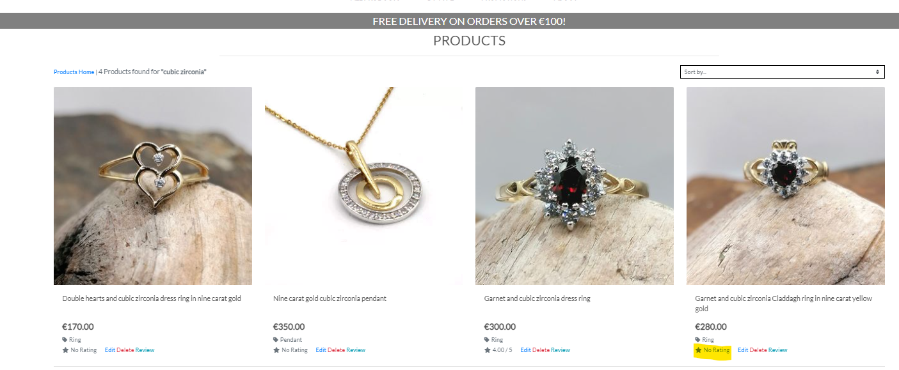

# Features within the Jeweller App:
 [Features](#features)

## Features
-----------
F01 Authentication and Login (DONE)
F02 SECURITY
F03 RESPONSIVENESS (DONE)
F04 NAVIGATION
F05 CLEAR SITE PURPOSE/ EASE OF USE
F06 USER FEEDBACK - TOASTS, EMAILS, SCREEN PROGRESSION (DONE)
F07 - VIEW / SEARCH PRODUCTS
F08 - FILTER PRODUCTS
F09 - SORT PRODUCTS
F10 - PRODUCT DETAILS
F11 - PRODUCT REVIEWS (DONE)
F12 - ABOUT PAGE/ USER FEEDBACK FORM (DONE)
F13 - CREATE SHOPPING BASKET - (INCLUDING SIZING AND PERSONALISATION) (DONE)
F14 - CREATE ORDER FROM SHOPPING BASKET (INCLUDING DELIVERY METHOD)
F15 - STRIPE PAYMENTS (WITH RESILIIENCE)
F16 - ORDER LIFECYCLE TRACKING, including ANPOST Tracking (DONE)
F17 - PRODUCT LEAD TIMES
F18 - USER PROFILE CREATION & MAINTENANCE
F19 - EMAIL INTEGRATION
F20 - SYSADMIN PRODUCT MAINTENANCE
F21 - SYSADMIN - ORDER MAINTENANCE
F22 - NEWSLETTER & MARKETING, SOCIAL LINKS
F23 - SEO
### F01 Authentication and Login
--------------------------------
In 'Guest' mode, a user can browse the site, make purchases, and make enquiries/give feedback to the shop owner.  This is perfect for first-time or casual users.  When an order is raised, the 'Guest' user will receive emails to notify them of the order's progress through despatch & delivery.   
To increase the user's engagement with the Jeweller shop, there are three further levels of involvement for users.

#### F01.1 Mailchimp signup

A user may choose to signup for emailed updates (typically newsletters) from the Jeweller, by entering their email address (no password) in the Mailchimp form.  The form is very visible to Guest users, and visible on the landing page thereafter.   Mailchimp handles email verification and manages duplication/ unsubscribe as needed, within an external database (separate to the Jeweller system).  The signup form appears for everyone on the landing page, and for Guest users throughout the site.

Signup for newsletter

#### F01.2 Register a profile on Jeweller
Signing in as a registered user gives extra functionality:
* Track previous/multiple order history on one screen
* Leave product reviews
* Personalise experience (greeting by my name)

A user who wishes to track their purchases may register by nominating (at minimum) a username, email adddress and password. Optionally they can store their name and phone number.  The email address must be verified before the user can first sign in.  A confirmation email is sent to the nominated email address, this contains a 'click to confirm' link to bring the user back to the site.  Note that password won't be accepted unless it complies with standard verification rules, min length, no common words, etc.
Password reminders and resets are permitted and handled through back-and-forth emails to the nominated email address.

Register as a new user - step 1 - provide details

Register as a new user - step 2 - confirmation email sent

Register as a new user - step 3 - confirmation email

Register as a new user - step 4 - attempt sign BEFORE confirming email

Register as a new user - step 5 - follow link given in confirmation email

Register as a new user - step 6 - see notification that email confirmed

Register as a new user - step 7 - signin notification

#### F01.3 User Profile

To further personalise the user's experience, a user can access and update their user profile.
* Modify profile picture
* Assign default delivery address
* Personalise my experience - on sign in, my profile picture and personalised welcome message are shown.
* Personalise my experience - profile pic is shown to other users on reviews I've created

User Profile page with order history, pic & addresses.  I am changing profile image/avatar 

User image shows with welcome message

User image shows on reviews I've created

#### F01.4 Sysadmin Users
Certain users have an additional level of security access:
* Able to access the site's backend to modify database entries
* Product management console for create-edit-delete of Jeweller's products
* Order management console to track lifecycle from order creation through to customer receipt.

#### Summary - F01

The functionality in feature **F01 Authentication and Login is quite wide**. This is based on the Django Allauth utility which provides a lot of standard templates and flows; these have been extended and customised for the Jeweller site. This satisfies user stories FTU_05 Navigation without mandatory login; FTU_03/SO_01 feedback at each step in a process; FTU_27 create a profile, RU_06 view order status; RU_04 receive prompts of upcoming celebration days; RU_08 newsletter;       

F02 SECURITY
### F02 Site security and Create-Read-Update-Delete Permissions
There are currently 4 levels of access to the Jeweller App.  Guest - Registered - Profile - SysAdmin  
Permissions are granted to database objects as follows:

N = No Access
C = Create
R = Read
U = Update
D = Delete

| User Type            | Description              | UserID                                         | User Profile & Personal Order Tracking                               | Products | Product Detail | Feedback/Enquiry | Reviews  | Basket | Order |  Comment Approval | Personal Task |
| -------------------- | ------------------------ | ---------------------------------------------- | ------------------------------------------- | ------- | ---------------- | ------------ | ---------------- | ------------ | --------------- | ----------------- | ------------- |
| **Guest**      | Never registered on site | none                                           | N - link disabled                           | R       | N                | N            | N                | R            | R               | N                 | N             |
| **User**     |                          |  Creates allauth 'User' by registering | CRU (auto created on registration) | Read    | N                | CRUD         | CRUD             | CRUD         | CR              | N                 | CRUD          |
|                      |
| **UserProfile**      | returning user           | R                                              | R                                           | R       | R                |  CRUD        | CRUD             | R (and copy) | CR              | N                 | CRUD          |
| **Sysadmin** | Shop owner     | CRUD                                           | CRUD                                        | CRUD    | CRUD             | CRUD         | CRUD             | CRUD         | CRUD            | CRUD              | CRUD          |
|                      |
|                      |

#### Muli-layered Security
The site is designed with multiple layers of security, so that a user generally may be unaware that an option exists as (e.g. Sysadmin menu, user profile option) the menu options will be hidden.  If a user becomes familiar with the URLs within the site, the options within these URLs perform verification and identity checks to ensure the user is a) registered and b) authorised to use the function, e.g. administrator functions.

User can edit their own profile, note the URL string

But if they attempt to modify someone else's profile by modifying the URL string, they receive a Toast error e.g./profile/11/

This satisfies user stories FTU_02 feedback; FTU_05 navigation; RU_09-RU_10 User Profile Maintenance;  SO_01 Site feedback; SO_02 robust error handling; SO_06 Product administration, SO_10 Order administration.

### F03 Responsiveness

The site is designed to work on mobile tablet and other devices.  The screen will redraw based on the screen width of the viewing device, so can be used on a range of convenient devices.  This is largely achieved using bootstrap screen column handling, with some supplementary media queries.   The site is responsive and will re-draw based on the viewing device type
While the front end tasks can be performed on a device of the user's choosing, tasks like sysadmin of orders and products is probably best done using a tablet or larger.

Site responsiveness

This satisfies FTU01 Ease of understanding; FTU02 Ease of navigation; FTU04 Access site on a device of my choosing; SO_02 Responsive site

### F04 Site Navigation
The site is designed with consistent navbar and footer (where applicable) across pages to make it easier to navigate from task to task.
   

For first-time users in browsing mode the navigation bar doesn't show a personalised welcome message, and the menu options are different.
Particularly, no 'My Planner' option as an unregistered user doesnt have access to this feature.

Sitemap
Pagination
Look and feel
Icons:

This addresses user stories 
* SO_04 As site owner I want to provide straightforward, intuitive, consistent website navigation, (using graphical navigation where possible, even where the destination leads to text-based informataion)
* SO_06 As site owner I want to provide a website, which meets current programming, performance and accessibility standards (html, css, javascript, responsive, accessibility, performance)
* FTU_03 As a first time user I would like to be able to easily navigate the site and quickly learn its functionality 
* FTU_06 As a first-time user I want clear, timely and unambiguous feedback and interaction
* FTU_07 As a first-time user I expect links and functions that work as expected

### F05 Clear site purpose and ease of use
F05 CLEAR SITE PURPOSE/ EASE OF USE

Header 
Footer 
landing Page

Order Flow
Brought straight to Products page from landing page, from product detail 'continue shopping', from shopping basket 'continue shopping'.
Basket - encouraged to progress to checkout
Checkout - single page, clear vision

### F06 USER FEEDBACK - TOASTS, FORM ERRORS, EMAILS, SCREEN PROGRESSION
Jeweller is designed to provide clear and consistent feedback to users as they progress through tasks.

#### Toasts - 5-second pop-up messages
These feedback messages are designed to guide a user through a process, giving them clear feedback that a step they've performed has been updated successfully. 
Examples realting to user setup were given under feature F01; similarly when the user updates the Jeweller database they see a confirmation message.

Examples:

#### On-screen Data verification and error messages targeted to form fields
Forms are used to gather information throughout the Jeweller site, examples are:
* Register as a new user 
* Add a review
* Leave feedback - user must use a valid email address
* Maintain a product

In this situation, error messages are specifically targeted at particular fields: the field is highlighted and the user is notified of the error.

Subscribe to newsletter

#### Screen progression
Users of Jeweller site will be involved in multi-step processes; Toasts are used to keep the user informed about where they are in the process, and what the next step might be. 

#### Feedback Emails:
Emails (customised for the jeweller site) are generated in certain work processes:
* User registration and authentication (customised allauth templates)
* User newsletter signup (Mailchimp)
* Order lifecycle tracking (python sendmail using customised templates) - sent when order is created, packed, shipped, received/collected
* Contact form - confirmation of enquiry logged (generated using emailjs)

Password reset email

Newsletter signup - confirmation email

Order creation - notification email

Order packed - notification email

Order shipped - notification email

Order received - notification email

Contact/Enquiry form - confirmation of receipt

The design of user feedback addresses user stories FTU_01,02 site navigation, FTU_03 Feedback at each step, FTU_21: email/text notifying me of my order number and lead time; FTU_22: enquiry form; FTU_26/RU_08 newsletter; RU_06 notification of order status;  RU_08 newsletter; RU_09 contact preferences; SO_01, 02 Error handling and feedback; SO_06 Order tracking; SO_12,13 Marketing promotions, SO_15 Extend walkthrough functionality for Jeweller site; SO_16 Employ marketing techniques.

F07 - VIEW / SEARCH PRODUCTS
### F07 View/ Search Products
----------------------

The full set of articles is available from the Articles link on the navigation bar. 
From this screen the user can see article title, image suggestive of content, summary/ excerpt, author, last updated, and gain an idea of article popularity, by seeing the number of likes, bookmarks and comments for the article.   'New' articles are flagged.

* SO_01 As site owner I want to provide a platform where users can directly access useful resources to help with real-life financial decision making
* SO_02 As site owner I want to largely (but not entirely) re-use/ connect to information from authoritative sources 
* SO_03 As site owner I want to avoid connecting to information which is opinion- rather than fact-based (ie perhaps from a less authoritative source) or at least highlight that the source is less authorative, or offered by a biased source.
* FTU_01 As a first time user I want to access relevant information to increase my financial understanding/literacy on a specific topic
* FTU_02 As a first-time user I about what this site does, and want to quickly understand this site's relevance to me, so I don't waste my time on useless engagement 
* FTU_03 As a first time user I would like to be able to easily navigate the site and quickly learn its functionality 

### F08 - FILTER PRODUCTS
-----------------------------
Can filter products seen based on category (rings, pendants etc)

* SO_05 As site owner I want to allow users to 'chop and dice' complex information into small chunks 
* FTU_01 As a first time user I want to access relevant information to increase my financial understanding/literacy on a specific topic
* FTU_02 As a first-time user I about what this site does, and want to quickly understand this site's relevance to me, so I don't waste my time on useless engagement 
* FTU_03 As a first time user I would like to be able to easily navigate the site and quickly learn its functionality 

### F09 - SORT PRODUCTS
-----------------------

### F10 - PRODUCT DETAILS
-----------------------
Product details functionality has been extended from the walkthrough to include the following fields:

Jeweller site - Product details

* SO_01 As site owner I want to provide a platform where users can directly access useful resources to help with real-life financial decision making
* SO_02 As site owner I want to largely (but not entirely) re-use/ connect to information from authoritative sources 
* SO_03 As site owner I want to avoid connecting to information which is opinion- rather than fact-based (ie perhaps from a less authoritative source) or at least highlight that the source is less authorative, or offered by a biased source.

### F11 PRODUCT REVIEWS
Any logged-in user can create a review of a product - the user doesn't need to first purchase the product. This was a deliberate design descision based on the Jeweller shop owner's experience with other social media sites, where positive comments from followers sparked interest amongst their friends and contacts - a form of organic marketing.  Similarly, reviews are shown with the user's name and avatar, which promotes social marketing and peer-user prompting.  Reviews will not be displayed, however, until approved by SysAdmin/ Moderator.  

Another reason for not limiting reviews to people who have purchased a certain product is that a significant proportion of products on display are expensive and limited-edition, which restricts the number of purchasers, however many people may admire the item of jewellery, or take inspiration from it.

Customers who make a purchase are encouraged, once they've received the item, to leave a review on the website for the purchased product.

Reviews are visible on the product detail page.  The average rating, and approved reviews count, is shown in the visible section of product detail screen, and liked to reviews towards the bottom of the page.  

Products with visible rating

Product detail rating (average) and link to reviews

Create review

Confirmation message on submitting review

Approve review (Sysadmin)

Approved Reviews

From a user perspective, this satisfies user stories FTU01, FTU_02, FTU_03 Site purpose, navigation & feedback; FTU_06, FTU_07, RU_01, RU_02 product selection and RU_13 create product reviews.

From a site owner's perspective this contributes to user stories SO_03 using site's social links to promote engagement; SO_04 extending the 'shop window' via the site; and contribues to an overall marketing approach which promotes user engagement. 

### F12 ABOUT PAGE/ USER FEEDBACK FORM

The About page is designed to be maintainable by the Shop Owner Admin.  In its current form it is a set of plaintext blocks including section headings with inline sequenced paragraphs within these.  A near-future enhancement is to apply Summernote styling to the text blocks, this was investigated during this project but found to be a little more complex to implement within Inline Model structures.  Currently the site is configured with three sections - About, FAQ and Feedback.

About - drop-down menu options

About Page - user view - 'About / FAQ'

About Page - modifying (Sysadmin)

About Page - modifying (Sysadmin)

Enquiry/ feedback form

This satisfies the user requirements SO_15 Extend the walkthrough models, and SO_17 SEO (as the About pages can also be used to build text strings which can be picked up by search engines); RU_07 Raise product enquiries on site; and FTU_01-05 Navigability.

### F13 CREATE SHOPPING BASKET (INCLUDING SIZING AND PERSONALISATION)
Jewellery site users can create a shopping basket.  The starting point is always a product detail page; from there the user has a quantity input, and an 'add to basket' button.
The user can assemble products, with personalisation, into a shopping basket.
The product detail page is always used as the 'launch' to add an item to the shopping basket.

Add to basket - standard item

Once added, the basket quantity for this item is maintained per item, ie the item will only appear once in the basket, and any subsequent additions will increase the quantity of this basket line.

If the item is a ring, then the ring size must be entered here, values can be chosen from a drop down

Add to basket - standard item

This defaults to 'Ring size M'
Once added, the basket quantity is seen at item/ size level, so the item could appear multiple times in the basket, and any subsequent additions will create a new line if a different size, or will increase qty on this line if the item/size combination already exists in the basket.

If the item is engraveable, then the user can enter text to be engraved on the item.
This defaults to 'No engraving'.
Note that ring and engraving are mutually exclusive as per the Jeweller shop owner's request (specialist equipment needed to engrave inside rings).

Add to basket - standard item

It is expected that many users will raise an order for one or two items, but larger baskets can be created with a combination of items as needed:

Basket with combination of items

Once created, the shopping basket can be maintained, with quantities per line increased/decreased/removed:

Basket with combination of items

And items can be removed from the shopping basket

Remove item from shopping basket

This meets user requirements FTU_01-05; FTU_15,16 Maintain Shopping basket; SO_04,05,15 (extend the walkthorough shopping basket models to include personalisation)

F14 CREATE ORDER FROM SHOPPING BASKET, including choosing delivery method

F15 STRIPE PAYMENTS (WITH RESILIIENCE)

### F16 - ORDER LIFECYCLE TRACKING, including ANPOST Tracking

One of the concerns that the Jeweller shop owners had about committing to a website was the ability to know what orders have been raised, and to track whether the order has been packed, shipped or received.  To alleviate some of the concerns about order tracking, a customised tracking portal was created, where the Sysadmin can progress an order through its various stages.
When the first version of order-level tracking was demonstrated to the Jeweller organisation, they pointed out that they need to see which wtems are on each order.  Therefore the display has been extended to show order details per order.   

To avoid excessive screen width a system of progressive reveal is used, with show-hide toggles for product details (of interest if at the **packing** stage) and order address (of interest if at the **shipping** stage).  An order can move through one of two lifecycles depending on the delivery method.
If delivery method = COLLECT then ORDERED -> PACKED -> RECEIVED -> CLOSED
If delivery method = REGPOST then ORDERED -> PACKED -> Assign Tracking ID -> SHIPPED -> RECEIVED -> CLOSED

For convenience, a show-hide button is also available for closed orders.

Order Tracking Portal - show products

Order Tracking Portal - show addresses

F17 PRODUCT LEAD TIMES

F18 - USeR PROFILE CREATION & MAINTENANCE

F19 - EMAIL INTEGRATION

### F20 - SYSADMIN PRODUCT MAINTENANCE
Admin users ('staff' users) can access a backend portal which allows create, read, update and delete of:
* Users (passwords are encrypted so an administrator can never read a users password)
* User profiles
* Articles
* Article actions
* Article-User Likes
* Article-User Bookmarks
* Article Comments
Site maintenance, including creation and publication of Articles, Response Moderation, and search term maintenance, is done by an administrator (a user flagged as 'staff') using the application back-end.

As the application has grown, this interface has increased in complexity.  It currently looks like this:

This administration portal has been adequate as a proof-of-concept whilst delivering the Finance Planner application.
However as number of articles increase, so does the maintenance overhead.  
The process for adding a new article is now:
* Create draft article with appropriate imagery and content
* Review the lifestage tags to determine which (if any) are most appropriate
* Either append "exact lifestage text" to the article tags; or update the tag table with the article primary key record #.
* Create any tasks (article actions) needed for the article and link them to the parent article.

As a next development step for the FinancialPlanner app, I would highly recommend developing an admin portal.  (FUTURE REQUIREMENT) 
This would allow an Article and each of its related elements to be maintained in sync.  This wasn't intially a requirement as the standard Django-delivered Admin Console was considered adequate, however the data complexity and maintenance overhead have increased as the site has neared completion, and data has been added.  

* SO-09 As site owner I would like to store a database of content to include url links, 
* SO-10 As site owner, I would like to have the capability to organise the content by lifestage, theme, and other criteria (possibly hierarchical groupings, hashtags) to allow cross referncing of user needs to content 

### F21 - SYSADMIN - ORDER MAINTENANCE
--------------------------------------

### F22 - NEWSLETTER & MARKETING, SOCIAL LINKS
----------------------------------------------

### F23 - SEO
-------------

### F16 Error Pages
-------------------
If, or when HTTP erorrs occur, a custom error page with a 'back to home' link displays.  This avoids the user needing to use the back button to get out of an error situation.  Errors 400, 403, 404 and 500 are covered

The 404 page would most likely be seen when the user inadvertently types in something on the URL bar which doesn't exist on the site:

The 500 page could be encountered if the user takes the option for example to reset their password - this link is not yet configured to communicate externally from the deployed FinancialPlanner site and will throw a 500 error.

### F07 Lifestage filter
A second type of search - a Lifestage filter - is available.  This allows searching for articles associated with a pre-defined theme.
These pre-defined themes are defined as 'tags' in the FinancialPlanner Administrator Console.

Tags are associated with articles, and there are two ways to update the assocation.  The first is to edit the tag field within the article and add the tag name within quotes, e.g. "Plan for Care in Later Life".  However this method is not ideal, as the field in the Admin Console is unvalidated and allows for free-format text entry.  If a search term is not exactly specified then a categorised article may not be retrieved as expected within Financial Planner.

A better way is to maintain from the tag perspective and to maintain a list of all articles associated with the tag.  Again this is not a perfect solution as the adminstrator must determine the ObjectID of each article, however it suffices at this time for proof-of-concept, and it ensures that the correct association is definitely made.  

Adding an article to a tagged list performs the corresponding update to the Article's 'Tags' field.

This addresses user stories:
* SO_05 As site owner I want to allow users to 'chop and dice' complex information into small chunks 
* FTU_01 As a first time user I want to access relevant information to increase my financial understanding/literacy on a specific topic
* FTU_02 As a first-time user I about what this site does, and want to quickly understand this site's relevance to me, so I don't waste my time on useless engagement 
* FTU_03 As a first time user I would like to be able to easily navigate the site and quickly learn its functionality 

### F10 Tasks
Articles may contain one more suggested tasks.  Often these will include a link, either to a site where the user needs to take a follow-on activity.  These could be:
- a URL connecting to a government website e.g. the Irish Revenue site
- a link to a Google sheet which can be personalised e.g. household budget 

N.B. For logged-in users, this is the expected step to create a new personal task, by coping an Article to a Personal task, from where the user can update the task as they progress with it.  
For registered users, a 'copy' icon is seen beside each action 
* SO_11 As site owner, I would like to encourague users to engage with each article's content, by providing suggested actions and next steps for the user to take 
* FTU_06 As a first-time user I want clear, timely and unambiguous feedback and interaction
* FTU_07 As a first-time user I expect links and functions that work as expected

### F12 Reading List
ability for a registered user to add an article to their reading list:

* SO_11 As site owner, I would like to encourague users to engage with each article's content, by providing suggested actions and next steps for the user to take 
* RU_01 As a returning user I want to mark information I find useful so I can quickly access it again (favourites)
* RU_02 As a returning user I want to create a user profile so that I can personalise my site experience (profile image, bookmarks, actions/tasks)

### F14 My Tasks

* CREATE A USER TASK:
A logged-in user can create a 'task' that is, a structured activity which is prompted by an article they have read.  A user task can be created either by copying an article task (the preferred method) or by direct keying of a new task.  Once the task is created, if can be accessed from the task list on the 'My Planner' dashboard, and can be edited, or indeed deleted, by the user.  
  
* READ TASKS:
On the MyPlanner dashboard, the number of tasks created by this user is shown, and can be hidden or revealed by the 'Show Tasks' button.

See user's task list.  Task 30 is selected for edit.  

* UPDATE TASKS:
An update panel is given, and the user updates the 'Progress' field

Press the Submit button.
A confirmation message is shown to confirm the update:

The update can be seen when the user's task list is re-displayed:

* DELETE TASK:
To delete a task, select the red 'bin' icon on the grid. Task 30 is now selected for delete:

A confirmation message appears, the total number of tasks is decremented, the task no longer shows on the task list

-----------------------------------------
----------------------------------------

### F16 Content Management - Article Creation

Feedback
Customer Testimonials

* SO_07 As site owner I want to provide an opportunity for the user to provide feedback, including reporting issues, or suggesting improvements to the Financial Planner site
* SO-08 As site owner I want to acknowledge to the user that their feedback has been received
* FTU_05  As a first-time user I would like to undertand the role of user feedback and user reviews 'X users found this useful or relevant',

### F16 Content Management - Article creation
The main elements of an article which are needed for creation are:
title, excerpt, body of article.
Through using summernote, there is reasonable editorial flexibility in creating article content.  
In the example below, an infographic was created usng Canva, and the summernote form was setup with a 2-colum table structure.
The infographic was inserted in the leftmost column and the text to the right.

With initial user testing, users had some difficulty reading screen content, therefore the best approach seems to be Arial-16 font 
(the number of fonts available within SummerNote is not extensive), with minimal text and good use of graphics or pictorial elements.
Note that summernote supports in-frame video from a range of providers, e.g. it was possible to use Veemo video links to embed some video from the RTE 'how to be good with money' series. 

The summernote Django extension is used to create article body.  It provides for 'rich' features such as a variety of fonts and text styles, the ability to incorporate images, video and URLs into content.  
The content loaded to this demonstration site illustrates some of this, and the site would now benefit by additional effort in content creation.

* SO_01 As site owner I want to provide a platform where users can directly access useful resources to help with real-life financial decision making
* SO_02 As site owner I want to largely (but not entirely) re-use/ connect to information from authoritative sources 
* SO_03 As site owner I want to avoid connecting to information which is opinion- rather than fact-based (ie perhaps from a less authoritative source) or at least highlight that the source is less authorative, or offered by a biased source.
* FTU_01 As a first time user I want to access relevant information to increase my financial understanding/literacy on a specific topic
* FTU_02 As a first-time user I about what this site does, and want to quickly understand this site's relevance to me, so I don't waste my time on useless engagement 
