# Features within Jeweller site:
1. [F01 Authentication and Login](#F01-Authentication-and-Login)
    1. [Newsletter signup](#F01.1-Mailchimp-signup)
    2. [Register as a user](#F01.2-Register-as-a-user)
    3. [Maintain user profile](#F01.3-User-Profile)
    4. [System administrator](#F01.4-Sysadmin)
    5. [Authentication and login - summary](#F01.5-Summary)
2. [F02 Site security and CRUD Permissions](#F02-Security)
    1. [Create Read Update Write permissions ](#F02.1-CRUD) 
    2. [Muli-layered Security](#F02.2-Multi-layered-security)
3. [F03 Responsiveness](#F03-responsiveness)
4. [F04 Site Navigation](#F04-site-navigation)
5. [F05 Ease of Use](#F05-ease-of-use)
6. [F06 USER FEEDBACK - TOASTS, EMAILS, SCREEN PROGRESSION](#F06-User-Feedback)
    1. [Notifications](#F06.1-notifications)
    2. [Form Validation](#F06.2-form-validation)
    3. [Feedback emails](#F06.3-feedback-emails)
7. [F07 View Products](#F07-view-search-products)
8. [F08 Filter Products](#F08-filter-products )
9. [F09 Sort Products](#F09-sort-products )
10. [F10 Product Details ](#F10-product-details )
11. [F11 Product Reviews](#F11-Reviews )
12. [F12 About Page & User Feedbackk Form](#F12-about )
13. [F13 Create Shopping Basket](#F13-basket )
    1. [standard products](#F13.1-standard-products)
    2. [Rings with sizing](#F13.2-sized-products)
    3. [Personalised products](#F13.3-engraved-products)
14. [F14 Create Order from Shopping Basket](#F14-create-order)
    1. [Order delivery method](#F14.1-delivery-method)
    2. [Order lead times](F14.2-lead-times)
    3. [Order Lifecycle](F14.3-order-status)
    4. [Confirmation emails](#F14.5-confirmation)
    5. [Order Visibility to the user ](#F14.5-profile)
15. [F15 Stripe Payments - with resilience](#F15-stripe)
16. [F16 Order Lifecycle tracking - including AnPost tracking](#F16-lifecycle)
17. [F17 Product Lead times](#F17-leadtimes)
18. [F18 User Profil Creation and Maintenace](#F18-user-profile)
19. [F19 Email Intgration](#F19-emails)
20. [F20 Sysadmin Product Maintenance ](#F20-sysadmin-products)
21. [F21 Sysadmin Order Maintenance ](#F21-sysadmin-orders)
22. [F22 Newsletter & Marketing, social links](#F22-marketing)
23. [F23 SEO](#F23-SEO)

### F01 Authentication and Login
--------------------------------
In 'Guest' mode, a user can browse the site, make purchases, and make enquiries/give feedback to the shop owner.  This is perfect for first-time or casual users.  When an order is raised, the 'Guest' user will receive emails to notify them of the order's progress through despatch & delivery.   
To increase the user's engagement with the Jeweller shop, there are three further levels of involvement for users.

#### F01.1 Mailchimp signup

A user may choose to signup for emailed updates (typically newsletters) from the Jeweller, by entering their email address (no password) in the Mailchimp form.  The form is very visible to Guest users, and visible on the landing page thereafter.   Mailchimp handles email verification and manages duplication/ unsubscribe as needed, within an external database (separate to the Jeweller system).  The signup form appears for everyone on the landing page, and for Guest users throughout the site.

Signup for newsletter

Confirmation email received on signuup

Further Subscribe/unsubcribe options are handled by the MailChimp platform. 

#### F01.2 Register as a user
Signing in as a registered user gives extra functionality:
* Track previous/multiple order history on one screen
* Leave product reviews
* Personalise experience (greeting by my name)

A user who wishes to track their purchases may register by nominating (at minimum) a username, email adddress and password. Optionally they can store their name and phone number.  The email address must be verified before the user can first sign in.  A confirmation email is sent to the nominated email address, this contains a 'click to confirm' link to bring the user back to the site.  Note that password won't be accepted unless it complies with standard verification rules, min length, no common words, etc.
Password reminders and resets are permitted and handled through back-and-forth emails to the nominated email address.

Register as a new user - step 1 - provide details

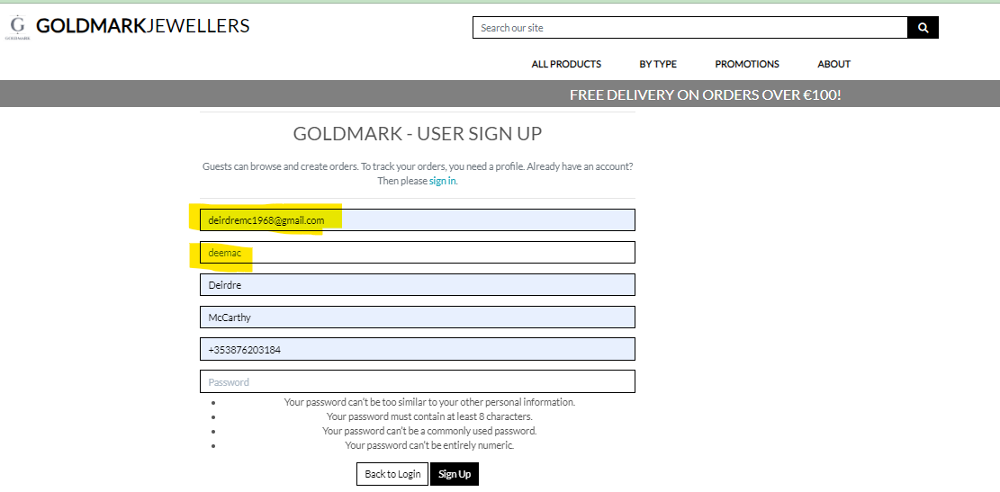

Register as a new user - step 2 - confirmation email sent

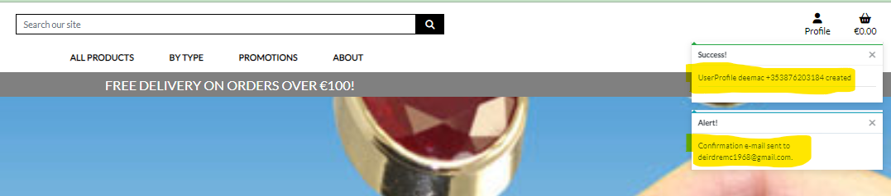

Register as a new user - step 3 - confirmation email

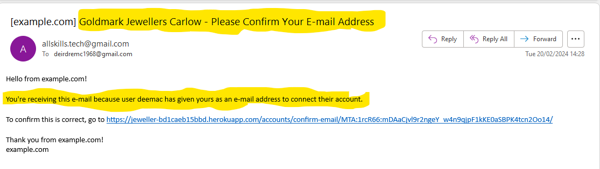

Register as a new user - step 4 - attempt sign BEFORE confirming email

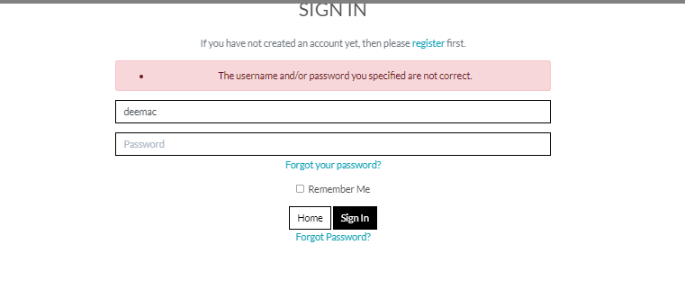

Register as a new user - step 5 - follow link given in confirmation email

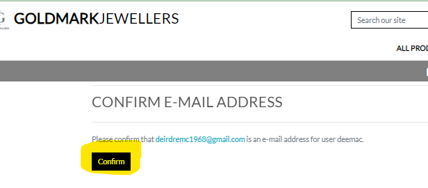

Register as a new user - step 6 - see notification that email confirmed

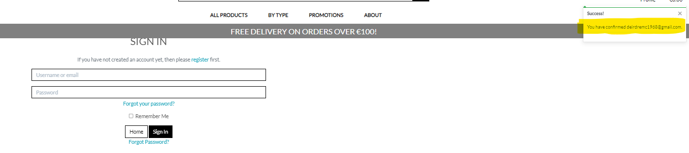

Register as a new user - step 7 - successful signin

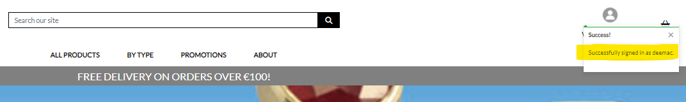

#### F01.3 User Profile

To further personalise the user's experience, a user can access and update their user profile.
* Modify profile picture
* Assign default delivery address
* Personalise my experience - on sign in, my profile picture and personalised welcome message are shown.
* Personalise my experience - profile pic is shown to other users on reviews I've created
* Increases social influence of reviews by 'recognising' other reviewers 

User Profile page with order history, pic & addresses.  I am changing profile image/avatar 

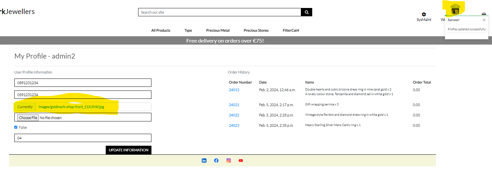

User image shows with welcome message

User image shows on reviews I've created

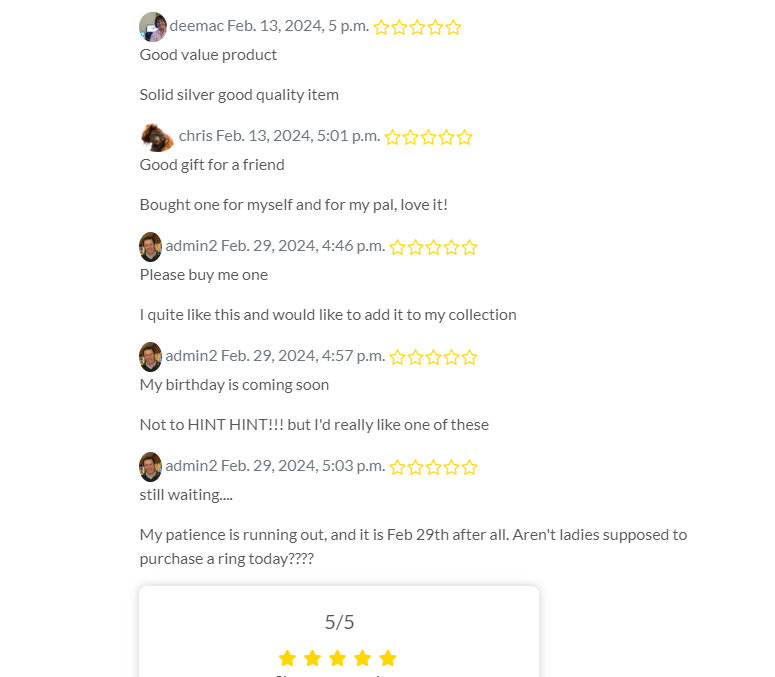

#### F01.4 Sysadmin
Certain users have an additional level of security access:
* Able to access the site's backend to modify database entries
* Product management console for create-edit-delete of Jeweller's products
* Order management console to track lifecycle from order creation through to customer receipt.

#### F01.5 Summary

The functionality in feature **F01 Authentication and Login is quite wide**. This is based on the Django Allauth utility which provides a lot of standard templates and flows; these have been extended and customised for the Jeweller site. This satisfies user stories FTU_05 Navigation without mandatory login; FTU_03/SO_01 feedback at each step in a process; FTU_27 create a profile, RU_06 view order status; RU_04 receive prompts of upcoming celebration days; RU_08 newsletter;       

### F02 Security

Security is defined at 4 levels of access to the Jeweller App.  
* Guest
* Registered User 
* SysAdmin (Front-end) 
* SysAdmin (Backend, via Django's admin console)  

Permissions are granted to database objects as follows:
N = No Access
C = Create
R = Read
U = Update
D = Delete

#### F02.1 CRUD
This table shows typical activities within the Jeweller site and who has permission to perform them.
In cases where 'self' is shown, it indicates only the objects the user has created themselves (e.g. their own user profile)

| User Type | Description | Register | User Profile | Products | Product Detail | Reviews | Inquiry form | Basket | Order | About Page Contents |
|--|--|--|--|--|--|--|--|--|--|--|
| **Guest** | Not registered on site | C | N | R | R | N | C | CRUD | CR | R |
| **User**  | Registered | N/A | RU (self) | R | R | CR | C | CRUD | CR | R |
| **Sysadmin - front-end** | Shop owner | N/A | RU(self) | CRUD | CRUD | R | R (via email) | CRUD | CR(self) | R |
| **Sysadmin - back-end** | Shop owner | CRUD | CRUD | CRUD | CRUD | CRUD | R (via email) | CRUD | CRUD | CRUD |

#### F02.2 Muli-layered Security
The site is designed with multiple layers of security, so that a user generally may be unaware that an option exists as (e.g. Sysadmin menu, user profile option) the menu options will be hidden.  If a user becomes familiar with the URLs within the site, the options within these URLs perform verification and identity checks to ensure the user is a) registered and b) authorised to use the function, e.g. administrator functions.

User can edit their own profile, note the URL string

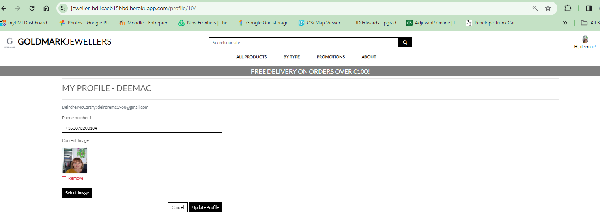

But if they attempt to modify someone else's profile by modifying the URL string, they receive an  error notification e.g./profile/11/

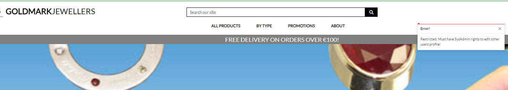

This satisfies user stories FTU_02 feedback; FTU_05 navigation; RU_09-RU_10 User Profile Maintenance;  SO_01 Site feedback; SO_02 robust error handling; SO_06 Product administration, SO_10 Order administration.

### F03 Responsiveness

The site is designed to work on mobile tablet and other devices.  The screen will redraw based on the screen width of the viewing device, so can be used on a range of convenient devices.  This is largely achieved using bootstrap screen column handling, with some supplementary media queries.   The site is responsive and will re-draw based on the viewing device type
While the front end tasks can be performed on a device of the user's choosing, tasks like sysadmin of orders and products is probably best done using a tablet or larger.

Site responsiveness

This satisfies FTU01 Ease of understanding; FTU02 Ease of navigation; FTU04 Access site on a device of my choosing; SO_02 Responsive site

### F04 Navigation
The site is designed to quickly become familiar, with a navigation bar along the top of the pages and a hamburger menu buttonfor smaller/ mobile screens.  For a signed-in user, the navbar is personalised with their profile image.

The site landing page shows a 'shop now' button as well as Newsletter signup - two immediate calls for action.   It is envisaged that first time users will explore both these CTAs, whereas returning users will immediately take the 'shop now' button which opens onto the Products 'display all' page. 

The footer contains contact details and social media links so the user can visit Facebook, Instagram, YouTube or LinkedIn to connect with the Jeweller business. While the Facebook icon links to a dummy business page specifically created for this project, Instagram and YouTube link to the real-life business pages.

(Images to follow)

This addresses user stories FTU_01-04 navigation, ease of use and responsiveness;  RU_01 quick navigation to the Products page,   SO_01-04 navigation and social links.

### F05 Ease of Use
Ease of use relates to how straightforward it is for a user to perform the workflows needed.
This depends on navigation, as described in F04, and on F06 Clear and consistent feedback at each process step.

Processes covered are:

| Process | Description | Described in Feature |
|--|--|--|
| Newsletter signup | How to signup for email updates | F01 |
| Registration | 7 Steps to register with the site | F01 |
| User Profile | Maintain own user profile | F01 |
| Product search & Selection | Finding and selecting items for basket | F07, F08 |
| Product reviews | Viewing & Creating | F10, F11 | 
| Basket | Creating and modifying a shopping basket | F13 |
| Order | Converting a basket to an Order, including payment | F14, F15 |
| Order - sysadmin | Managing order lifecycle from creation to fulfillment | F16 |
| Products - sysadmin | Creating, maintaining and controlling visibility of Products | F17 |

Most processes involve multiple steps, these are signposted to the user.  Screens are designed with minimal distraction, to encourage the user to progress to the next step (e.g. product detail -> 'add to basket'; basket -> checkout; basket -> 'continue shopping') 

This covers user stories FTU_01-03 navigation and ease of learning; FTU_06 ease of product visibility; RU_01-04 ease of navigation and information flow; SO_01-07 relating to extending the site as a 'shop window' and promoting engagement with site content.

At Jeweller Version 1, the Sysadmin (front end) functions hold product and order maintenance, the system administrator must use the Django backend for functions such as Moderating Reviews, maintaining StockType lead times, and maintaining 'About Page' contents.  Mailchimp is administered separately to the Jeweller app, and inquiries go straight to the Jewellers email.  Sysadmin will need to monitor consistency across Mailchimp, email and the Jeweller app.  Over time, it may make sense to integrate these channels into the Jeweller app itself.     

### F06 USER FEEDBACK
 - TOASTS, FORM ERRORS, EMAILS, SCREEN PROGRESSION
 Jeweller is designed to provide clear and consistent feedback to users as they progress through tasks.

#### F06.1 Notifications
Toasts are notifications which pop up and remain on-screen for 5 seconds.
Notifications help users through multi-step processes, giving them clear feedback at each step performed, and ideally letting the user know what's going to hapen next, or any action needed from the user to make something happen. 
For example, notifications are shown in the screnprints for new user registration in features section F01.
Similarly when the user makes a change that updates the Jeweller database, they get a notification/confirmation poop-up message.
Users of Jeweller site will be involved in multi-step processes; Toasts are used to keep the user informed about where they are in the process, and what the next step might be. 

#### F06.2 Form validation 
On-screen Data validation on form fields, gives a targeted error and highlights the specific field in error.
Forms are used to gather information throughout the Jeweller site, examples are:
* Register as a new user 
* Add a review
* Leave feedback - user must use a valid email address
* Maintain a product

In this situation, error messages are specifically targeted at particular fields: the field is highlighted and the user is notified of the error.

Form validation example1 - user has already subscribed to newsletter
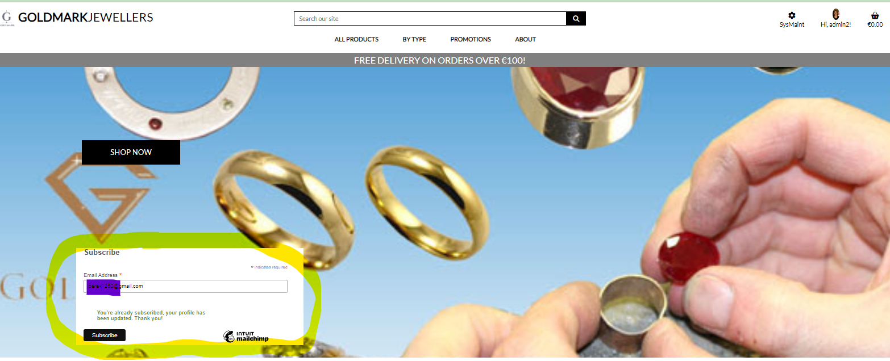

For validation example2 - user tries to register with simplistic password
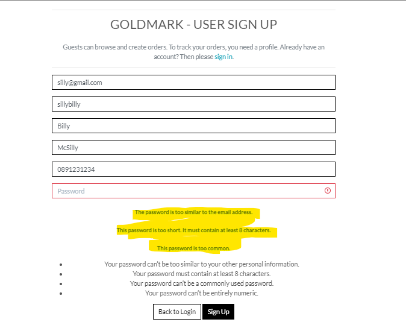

#### F06.3 Feedback Emails:
Emails (customised for the jeweller site) are generated in certain work processes:
* User registration and authentication (customised allauth templates)
* User newsletter signup (Mailchimp)
* Order lifecycle tracking (python sendmail using customised templates) - sent when order is created, packed, shipped, received/collected
* Contact form - confirmation of enquiry logged (generated using emailjs)

Password reset email
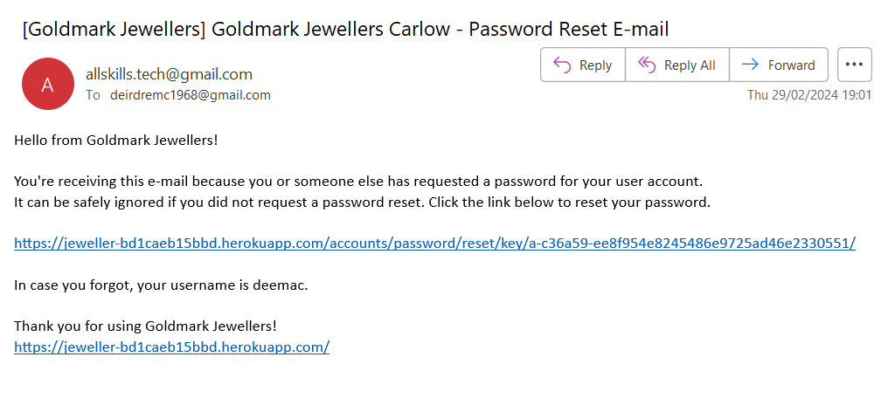

Newsletter signup - confirmation email
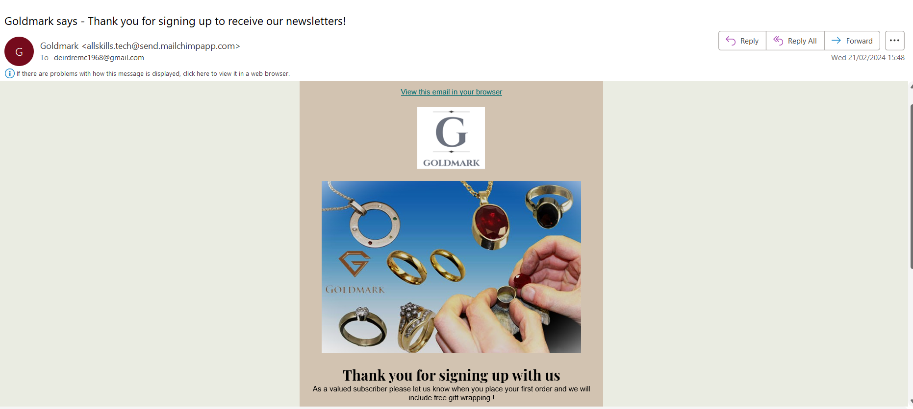

Order Lifecycle step 1 - creation - notification email
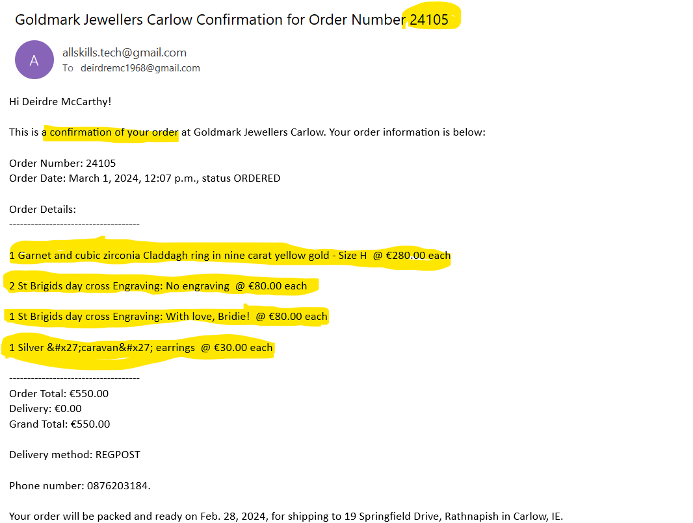

Order Lifecycle step 2 - packing - notification email
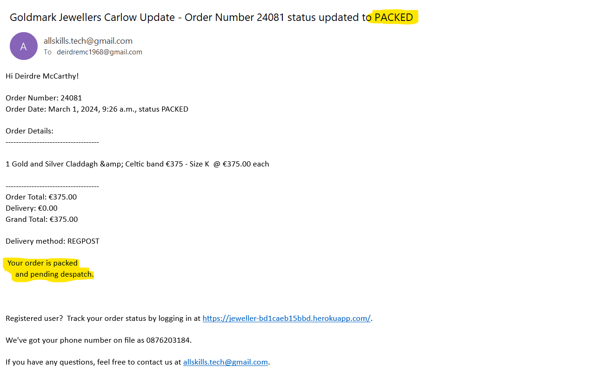

Order Lifecycle step 3 - shipping - notification email
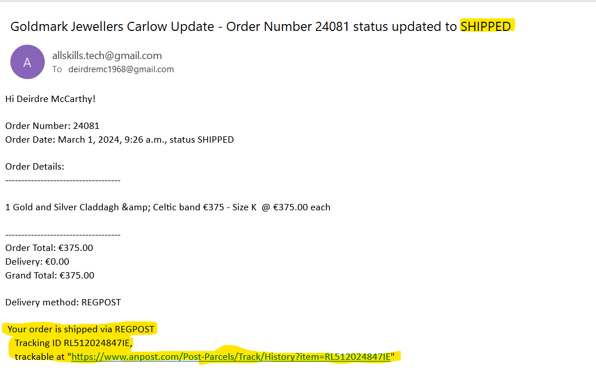

Order Lifecycle step 4 - receipt - notification email
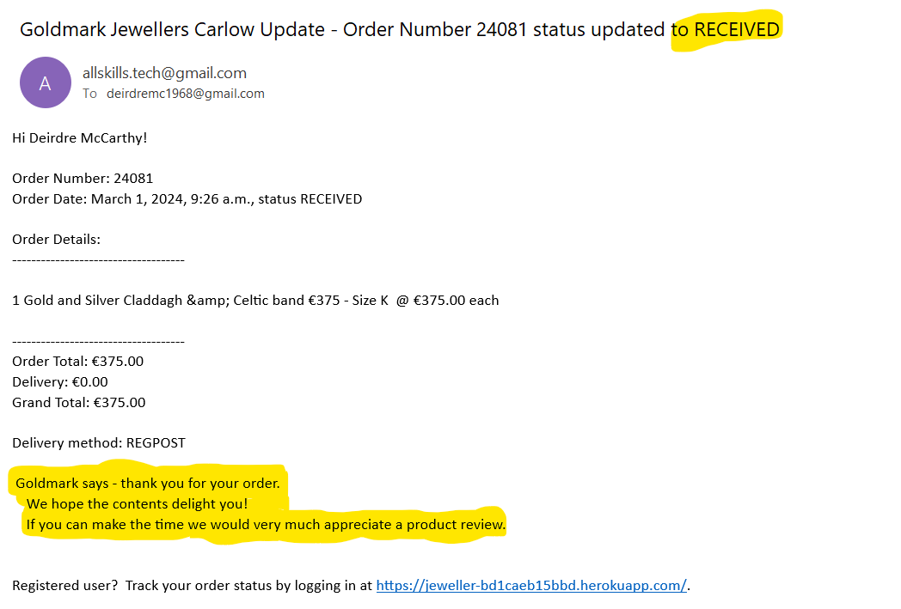

Contact/Enquiry form - confirmation of receipt

The design of user feedback addresses user stories FTU_01,02 site navigation, FTU_03 Feedback at each step, FTU_21: email/text notifying me of my order number and lead time; FTU_22: enquiry form; FTU_26/RU_08 newsletter; RU_06 notification of order status;  RU_08 newsletter; RU_09 contact preferences; SO_01, 02 Error handling and feedback; SO_06 Order tracking; SO_12,13 Marketing promotions, SO_15 Extend walkthrough functionality for Jeweller site; SO_16 Employ marketing techniques.

### F07 View Products
----------------------
View and Sarch Products:   Initially when the 'shop now' button is taken, the Products page is displayed with all products shown.  This works the same for First-time and Registered users, with some additional Sysadmin options.  This page is device-responsive so will show in 4-columns of product on widest screens, down to single-column on smaller screeens.

View products - desktop view

View products - Tablet view

View products - mobile view

This meets the requirements for FTU_05,06 navigate without mandatory login and see the range of products offered by Jeweller; FTU_08 Product search, RU_01-04; SO_08-10 relating to display of product range.

### F08 - FILTER PRODUCTS
-----------------------------
Can filter products seen based on category (rings, pendants etc)

### F09 - SORT PRODUCTS
-----------------------
Can sort products according to pre-defined criteria to reflect what is most important to the user, e.g. by price, by most recent/date added, etc

Product sorting - newest first
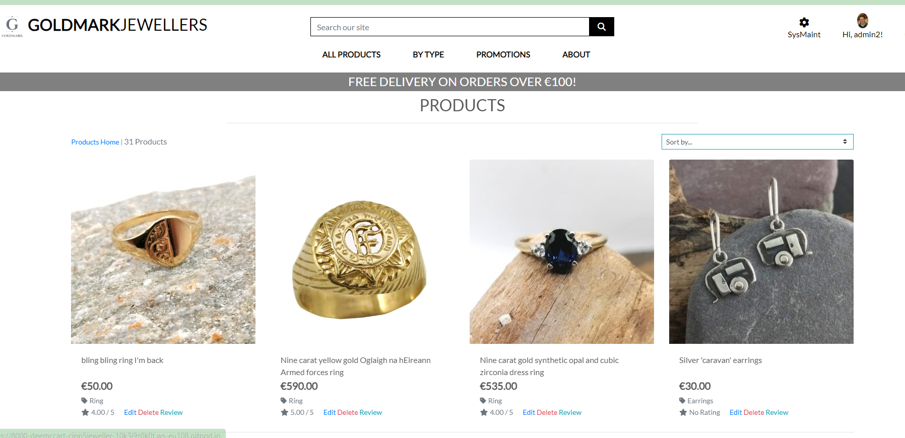

### F10 - PRODUCT DETAILS
-----------------------
Product details functionality has been extended from the walkthrough to include the following fields:

Jeweller site - Product details

### F11 Product Reviews
A logged-in user can create a review of a product - the user doesn't need to first purchase the product. This was a deliberate design descision based on the Jeweller shop owner's experience with other social media sites, where positive comments from followers sparked interest amongst their friends and contacts - a form of organic marketing.  Also, the jewellery products displayed may be expensive or limited-edition items, which restricts the number of purchasers, however many people may admire the item of jewellery, or take inspiration from it, and wish to leave a review on that basis.

Reviews are shown with the user's name and avatar, which promotes social marketing and peer-user prompting.  Reviews will not be displayed, until approved by SysAdmin/ Moderator.  

Customers who make a purchase are encouraged, once they've received the item, to leave a review on the website for the purchased product.

Reviews are visible on the product detail page.  The average rating, and approved reviews count, is shown in the visible section of product detail screen, and liked to reviews towards the bottom of the page.  

Products page - Guest User - view rating 

Products page - Signed-in User - view/add rating and choose to go directly and leave a review 

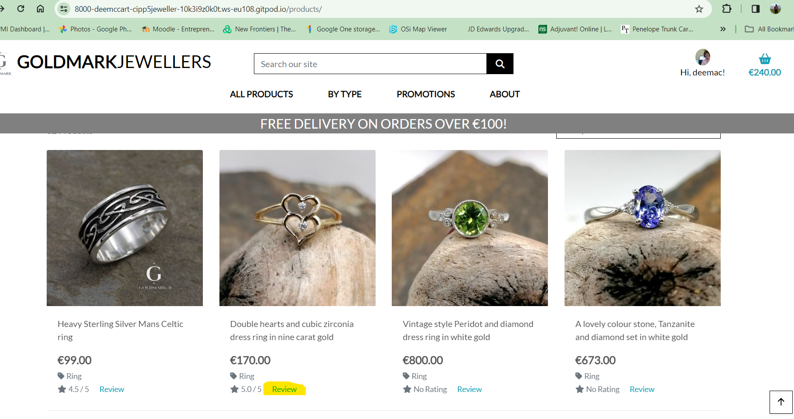

which brings the signed-in user directly to the Product Detail - Reviews section 

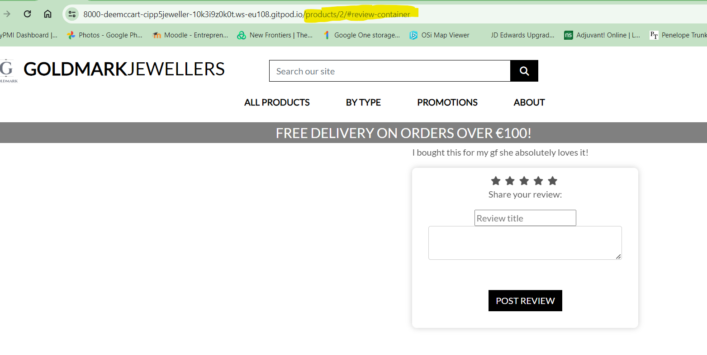

Product detail shows aerage rating with link to reviews

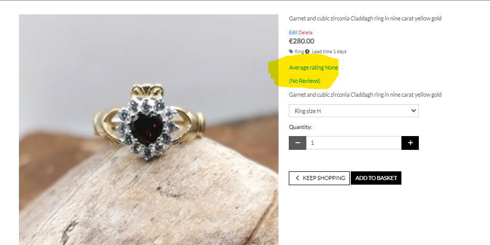

Create review

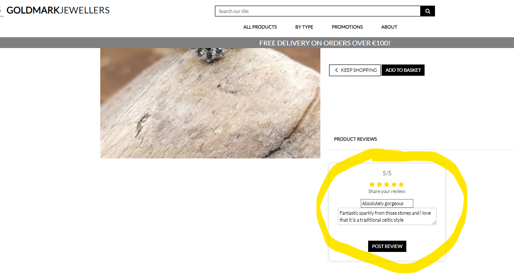

Confirmation message on submitting review

Approve review (Sysadmin)
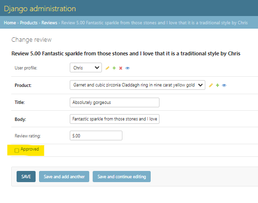

Approved Reviews
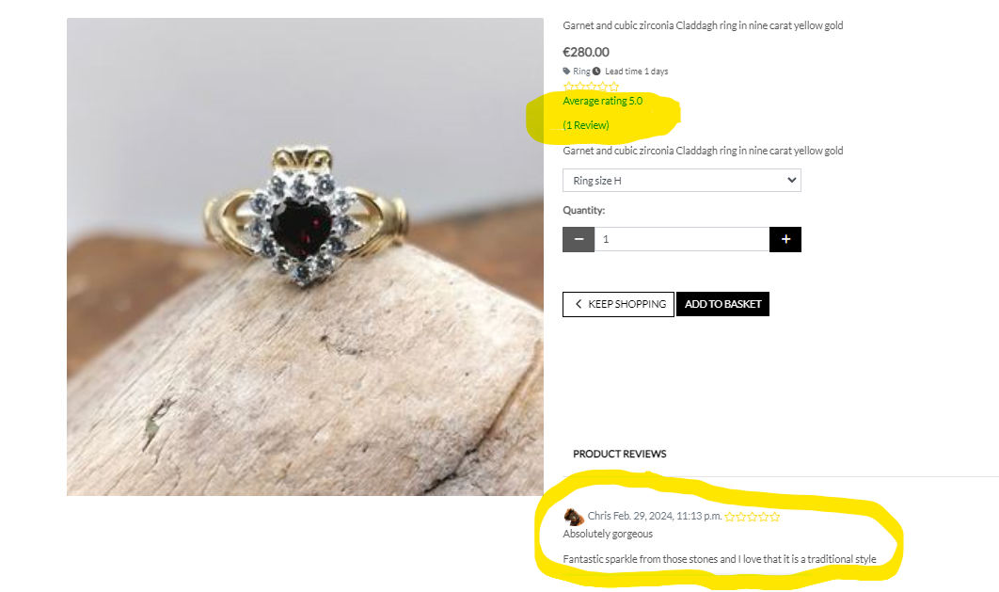

From a user perspective, this satisfies user stories FTU01, FTU_02, FTU_03 Site purpose, navigation & feedback; FTU_06, FTU_07, RU_01, RU_02 product selection and RU_13 create product reviews.

From a site owner's perspective this contributes to user stories SO_03 using site's social links to promote engagement; SO_04 extending the 'shop window' via the site; and contribues to an overall marketing approach which promotes user engagement. 

### F12 ABOUT PAGE/ USER FEEDBACK FORM

The About page is designed to be maintainable by the Shop Owner Admin.  In its current form it is a set of plaintext blocks including section headings with inline sequenced paragraphs within these.  A near-future enhancement is to apply Summernote styling to the text blocks, this was investigated during this project but found to be a little more complex to implement within Inline Model structures.  Currently the site is configured with three sections - About, FAQ and Feedback.

About - drop-down menu options
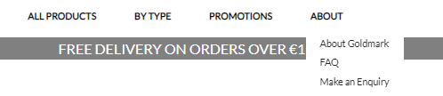

About Page - user view - 'About / FAQ'
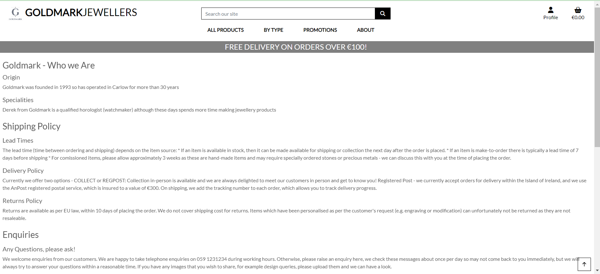

About Page - modifying (Sysadmin)
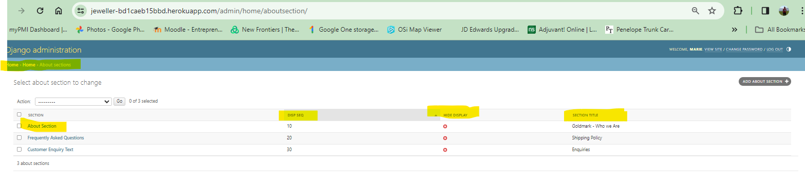

About Page - modifying (Sysadmin)

Enquiry/ feedback form
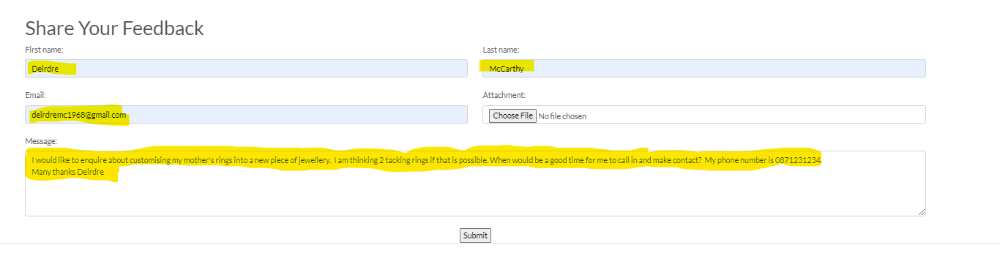

This satisfies the user requirements SO_15 Extend the walkthrough models, and SO_17 SEO (as the About pages can also be used to build text strings which can be picked up by search engines); SO_17 Tailor messages on About page to become closer to customers; RU_07 Raise product enquiries on site; and FTU_01-05 Navigability.

### F13 CREATE SHOPPING BASKET (INCLUDING SIZING AND PERSONALISATION)
Jewellery site users can create a shopping basket.  The starting point is always a product detail page; from there the user has a quantity input, and an 'add to basket' button.
The user can assemble products, with personalisation, into a shopping basket.
The product detail page is always used as the 'launch' to add an item to the shopping basket.

Add to basket - standard item

Once added, the basket quantity for this item is maintained per item, ie the item will only appear once in the basket, and any subsequent additions will increase the quantity of this basket line.

If the item is a ring, then the ring size must be entered here, values can be chosen from a drop down

Add to basket - standard item

This defaults to 'Ring size M'
Once added, the basket quantity is seen at item/ size level, so the item could appear multiple times in the basket, and any subsequent additions will create a new line if a different size, or will increase qty on this line if the item/size combination already exists in the basket.

If the item is engraveable, then the user can enter text to be engraved on the item.
This defaults to 'No engraving'.
Note that ring and engraving are mutually exclusive as per the Jeweller shop owner's request (specialist equipment needed to engrave inside rings).

Add to basket - standard item

It is expected that many users will raise an order for one or two items, but larger baskets can be created with a combination of items as needed:

Basket with combination of items

Once created, the shopping basket can be maintained, with quantities per line increased/decreased/removed:

Basket with combination of items
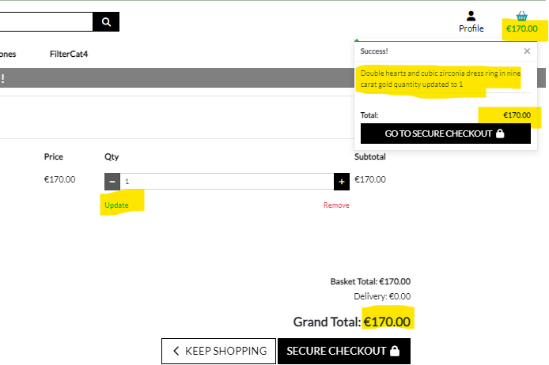

And items can be removed from the shopping basket

Remove item from shopping basket
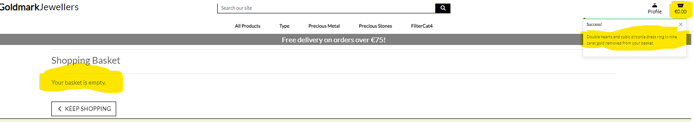

This meets user requirements FTU_01-05; FTU_15,16 Maintain Shopping basket; SO_04,05,15 (extend the walkthorough shopping basket models to include personalisation)

### F14 CREATE ORDER FROM SHOPPING BASKET
Including choosing delivery method

### F15 STRIPE PAYMENTS
Including  (WITH RESILIIENCE)

### F16 ORDER LIFECYCLE
TRACKING, including ANPOST Tracking

One of the concerns that the Jeweller shop owners had about committing to a website was the ability to know what orders have been raised, and to track whether the order has been packed, shipped or received.  To alleviate some of the concerns about order tracking, a customised tracking portal was created, where the Sysadmin can progress an order through its various stages.
When the first version of order-level tracking was demonstrated to the Jeweller organisation, they pointed out that they need to see which wtems are on each order.  Therefore the display has been extended to show order details per order.   

To avoid excessive screen width a system of progressive reveal is used, with show-hide toggles for product details (of interest if at the **packing** stage) and order address (of interest if at the **shipping** stage).  An order can move through one of two lifecycles depending on the delivery method.
If delivery method = COLLECT then ORDERED -> PACKED -> RECEIVED -> CLOSED
If delivery method = REGPOST then ORDERED -> PACKED -> Assign Tracking ID -> SHIPPED -> RECEIVED -> CLOSED

For convenience, a show-hide button is also available for closed orders.

Order Tracking Portal - show products
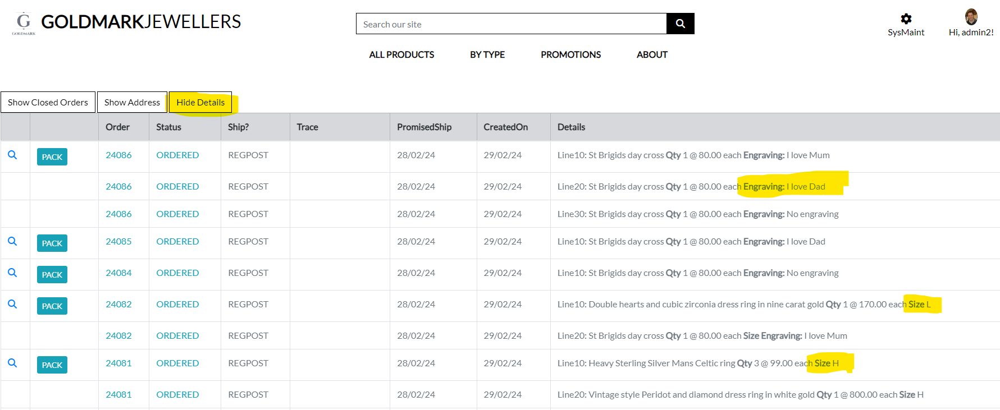

Order Tracking Portal - show addresses
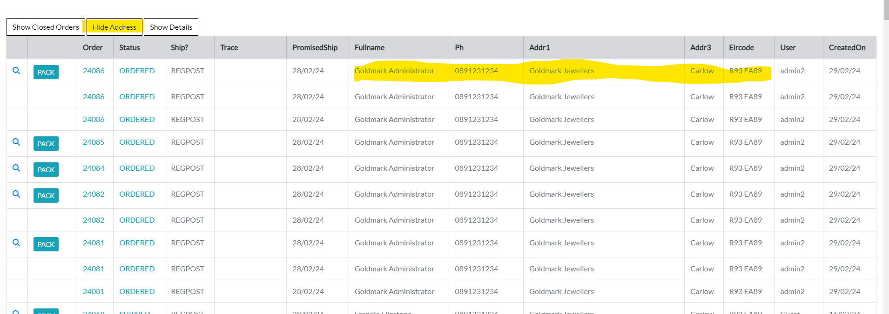

### F17 PRODUCT LEAD TIMES
This was a desired feature but not fully implemented

### F18 - USER PROFILE CREATION & MAINTENANCE
Already covered in section F01

### F19 - EMAIL INTEGRATION
Already covered?

### F20 - SYSADMIN PRODUCT MAINTENANCE
Products can be maintained by sysadmin users directly from either the 'products' or 'product detail' pages.
This means of access is handy when, for example. Admin notices a product that doesn't look quite right and needs a quick amendment.

All Products page, signed in as admin

Product detail page, signed in as admin

For editing multiple products, an admin user has a sysadmin menu option - Product maintenance.
This opens a maintance grid where all products are listed and can be maintained by taking an 'add', 'edit' or 'delete' button.

Product detail page, signed in as admin

The fields for editing include:
* Product name
* hidden from display? (this can be used instead of deleting products, particularly when orders exist)
* category (ring, bracelet, pendant etc) - this is sigificant as choosing 'ring' makes sizing mandatory
* description
* stocking type (stock, made-to-order, custom - this is significant as it determines default product lead time)
* can be engraved - important becuase this triggers an offer to capture personalisation text when added to basket
* 

Product add/maintain, setting as personalisable/engraveable

Product detail page, signed in as admin

Product detail page, signed in as admin

### F21 - SYSADMIN - ORDER MAINTENANCE
--------------------------------------
Already covered???

### F22 - NEWSLETTER & MARKETING, SOCIAL LINKS
----------------------------------------------
Documented in main readme document

### F23 - SEO
-------------
Documented in main readme document

### FXX Error Pages
-------------------
If, or when HTTP erorrs occur, a custom error page with a 'back to home' link displays.  This avoids the user needing to use the back button to get out of an error situation.  Errors 400, 403, 404 and 500 are covered
